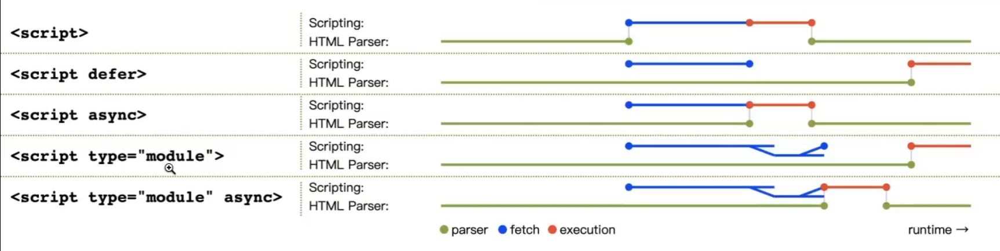
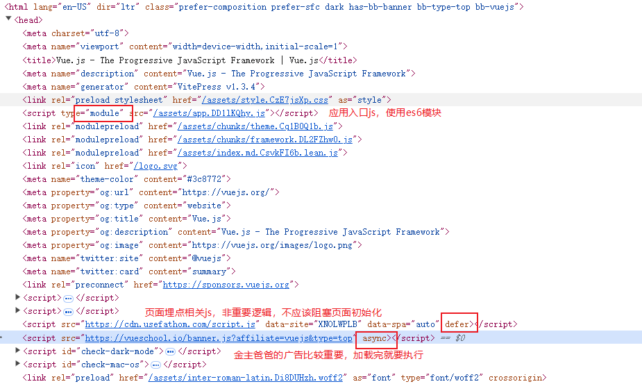
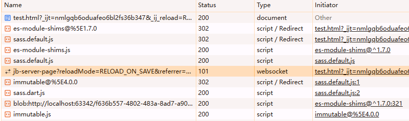
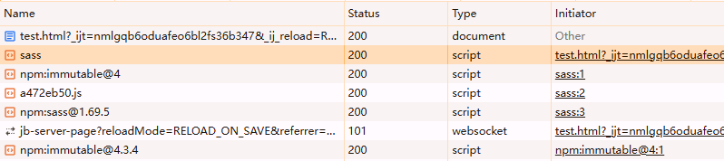
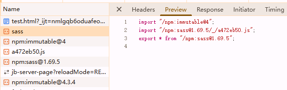
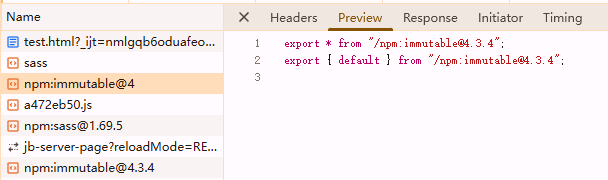

# \<script>

* 推荐看《JavaScript高级程序设计》第二章，对这个标签介绍得很详细。
* type属性，平时都是用`type="text/javascript"`比较多，ES6模块则用`type="module"`
* crossorigin，对于**跨域CDN资源**的加载，通常会设置为anonymous。假设有个业务页面域名是A.example.com，引入的CDN资源是cdn.example.com，这时候遇到两个问题：1.跨域的js资源运行出错的话，`window.onerror` 捕获的时候，内部的`error.message`只能看到`Script error.`看不到完整的错误内容; 2.请求js资源通常是不需要携带用户的身份凭据的（通常是cookie）这时候就需要设置crossorigin属性为anonymous。
* 还有两个安全相关的属性：integrity、nonce。如果安全要求较高，可以考虑使用。


* defer 立即下载，推迟执行
* async 异步下载，立即执行（并阻塞）





## 浏览器原生ES模块

::: sandbox {template=static}
```html index.html
<!DOCTYPE html>
<html lang="en">
<head>
  <meta charset="UTF-8">
  <title>Title</title>
  <script type="importmap">
    {
      "imports": {
        "immutable": "https://unpkg.com/immutable@^4.0.0",
        "sass": "https://unpkg.com/sass@^1.63.0/sass.default.js"
      }
    }
  </script>

  <!-- Support browsers like Safari 16.3 without import maps support. -->
  <script async src="https://unpkg.com/es-module-shims@^1.7.0" crossorigin="anonymous"></script>

  <script type="module">
    import * as sass from 'sass';

    console.log(sass.compileString(`
    .box {
      width: 10px + 15px;
    }
  `));
  </script>
</head>
<body>
  <div>检查console和network</div>
</body>
</html>
```
:::



## es-module-shims

当一个浏览器（比如 Safari 16.3）不支持 `<script type="importmap">` 时，`es-module-shims` 会作为 polyfill 完整接管模块的解析与加载流程。它的核心工作方式可以拆成下面几步。

### 1. 捕获并保存 import map

* 浏览器遇到 `<script type="importmap">` 时，由于不支持，会把它当作普通的 data block，不采取任何动作。
* `es-module-shims` 脚本加载并执行后，通过 DOM API 找到这个标签，解析其中的 JSON 配置，记录下映射关系：
  * `"sass"` → `"./node_modules/sass/sass.default.js"`
  * `"immutable"` → `"./node_modules/immutable/dist/immutable.es.js"`

### 2. 阻止浏览器原生模块系统执行

这是最关键的一步。如果不加干预，浏览器遇到 `<script type="module">` 时会：

* 记录该模块（内联模块类似 `defer`，会在 HTML 解析完成后执行）；
* 执行时看到 `import * as sass from 'sass'`，因为不认识 bare specifier `'sass'`，直接报错。

`es-module-shims` 会抢在浏览器执行这些模块之前“劫持”它们：


```js
// shim 内部大致逻辑
document.querySelectorAll('script[type="module"]').forEach(script => {
  script.setAttribute('type', 'module-shim'); // 修改 type，让浏览器不再将其视为模块
});
```


因为内联 `<script type="module">` 的执行时机是**整个文档解析完之后、`DOMContentLoaded` 之前**，而 `es-module-shims` 的 `async` 脚本一般会在此之前下载并执行完毕（或者至少赶在模块执行前完成初始化）。这样，浏览器就不会尝试去加载、执行那个模块了。

### 3. 重写模块的导入说明符

`es-module-shims` 拿到被劫持的模块源码（内联脚本直接用 `textContent`，外联用 `fetch`），然后利用自己的解析器分析 `import` / `export` 语句。

在源码中碰到：

```js
import * as sass from 'sass';
```

它会用第 1 步保存的 import map 把 `'sass'` 替换成：

```js
import * as sass from './node_modules/sass/sass.default.js';
```

### 4. 用 polyfill 的模块加载器执行

重写后的模块代码不能直接交给浏览器原生的 `import()`，因为要保证整个依赖图都被接管。`es-module-shims` 的做法通常是：

* 把重写后的模块代码包装成一个 **Blob URL**，或者通过动态 `import()` 处理已经解析好的模块图；
* 自己实现一个微型的 ES 模块加载器，递归解析依赖，应用 import map 重写，再构造执行环境；
* 最终让模块按照正确的顺序执行，使 `sass.compileString(...)` 能正常工作。


## [jspm](https://github.com/jspm/jspm)

Import Map Package Manager

::: sandbox {template=static}
```html index.html
<!DOCTYPE html>
<html lang="en">
<head>
  <meta charset="UTF-8">
  <title>Title</title>
  <script type="module">
    import * as sass from 'https://jspm.dev/sass';

    console.log(sass.compileString(`
    .box {
      width: 10px + 15px;
    }
  `));
  </script>
</head>
<body>
  <div>检查console和network</div>
</body>
</html>
```
:::






