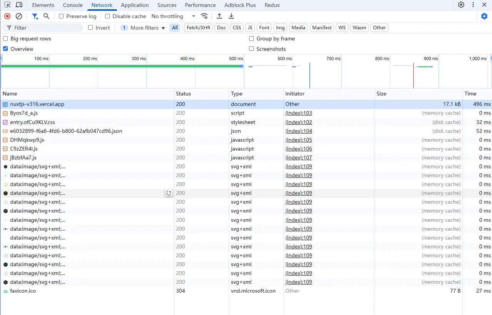

# HTTP Caching

* 强缓存 Strong cache
* 协商缓存 Negotiation cache

> HTTP协议中规定使用GMT时间，也就是格林威治标准时间，而我们国家使用的是GMT+8时区，所以在HTTP头信息中的时间会比我们的正常时间早8个小时，但它一点都不影响HTTP缓存的正常工作。

## 缓存获取顺序

> 按照缓存顺序来讲，当一个资源准备加载时，浏览器会根据其**三级缓存原理**进行判断。
>
> 1. 浏览器会率先查找内存缓存，如果资源在内存中存在，那么直接从内存中加载
> 2. 如果内存中没找到，接下去会去磁盘中查找，找到便从磁盘中获取
> 3. 如果磁盘中也没有找到，那么就进行网络请求，并将请求后符合条件的资源存入内存和磁盘中
>
> 浏览器内存缓存生效的前提下，JS 资源的执行加载时间会影响其是否被内存缓存
>
> 图片资源（非 base64）也有和 JS 资源同样的现象，而 CSS 资源比较与众不同，其被磁盘缓存的概率远大于被内存缓存。
>
> 当使用 preload 预加载资源后，笔者发现该资源一直会从磁盘缓存中读取，JS、CSS 及图片资源都有同样的表现，这主要还是和资源的渲染时机有关，在渲染机制还没有介入前的资源加载不会被内存缓存。
>
> prefetch 则表示预提取，告诉浏览器加载下一页面可能会用到的资源，浏览器会利用空闲状态进行下载并将资源存储到缓存中。
>
> 比如：访问图片-> 200 -> 退出浏览器
>
> 再进来-> 200(from disk cache) -> 刷新 -> 200(from memory cache)
>
> 我们可以打开一个新的tab页面，打开 "Network"，刷新一下，看到缓存的 `.js` 都是 "from memory"（`.css` 不会走 memory cache，都是 "from disk"）。
>
> 现在我们关闭当前tab（或关闭浏览器），重新再打开之前的 tab 时，缓存的 `.js` 都是 "from disk" 了。
>
> 因为当 `.js` 等资源被加载时，浏览器会先将其放入 `memory cache` 中，而当此页面tab被关闭时，浏览器会将此页面的 `memory cache` 中的缓存文件转存到 `disk cache` 中持久化存储。

https://nuxtjs-v316.vercel.app/

## References

* https://segmentfault.com/a/1190000007729685

* https://blog.devgenius.io/web-application-performance-optimization-http-caching-791eeda4509e

* https://juejin.cn/post/7177568033316012088

* https://www.cnblogs.com/developer-ios/p/14044834.html
