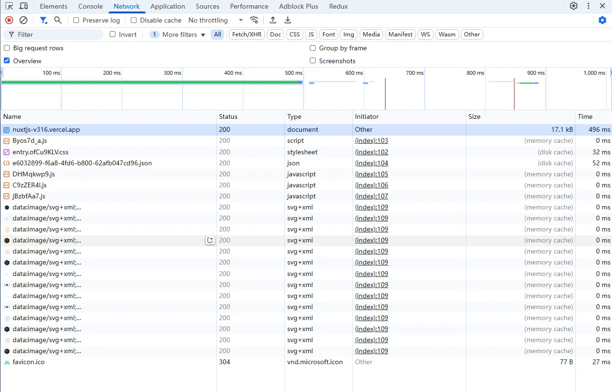
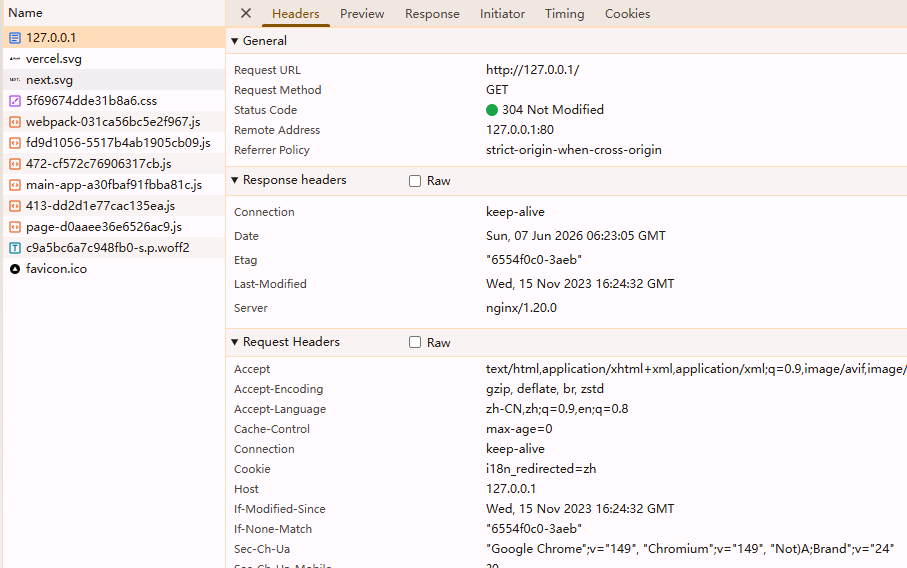
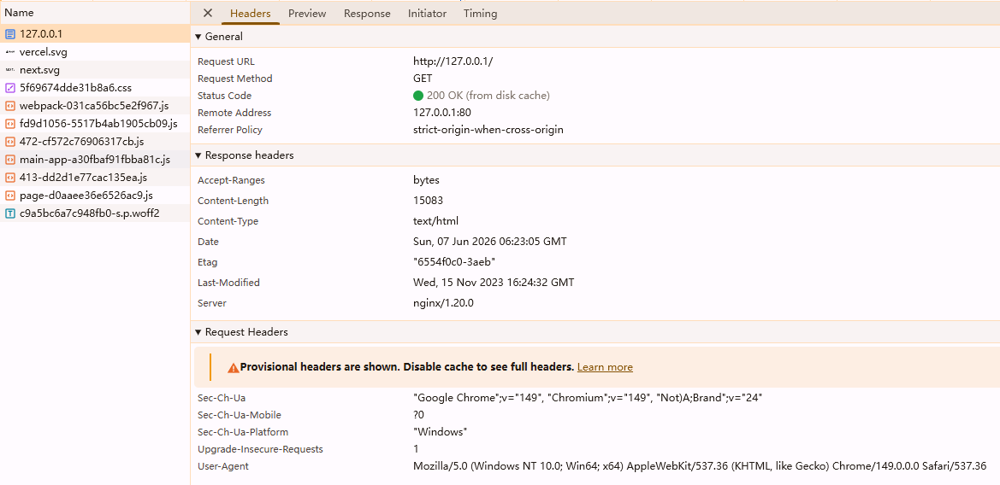

# HTTP Caching

* 强缓存 Strong cache
* 协商缓存 Negotiation cache

> HTTP协议中规定使用GMT时间，也就是格林威治标准时间，而我们国家使用的是GMT+8时区，所以在HTTP头信息中的时间会比我们的正常时间早8个小时，但它一点都不影响HTTP缓存的正常工作。


## 缓存获取顺序

> 按照缓存顺序来讲，当一个资源准备加载时，浏览器会根据其**三级缓存原理**进行判断。
>
> 1. 浏览器会率先查找内存缓存，如果资源在内存中存在，那么直接从内存中加载
> 2. 如果内存中没找到，接下去会去磁盘中查找，找到便从磁盘中获取
> 3. 如果磁盘中也没有找到，那么就进行网络请求，并将请求后符合条件的资源存入内存和磁盘中
>
> 浏览器内存缓存生效的前提下，JS 资源的执行加载时间会影响其是否被内存缓存
>
> 图片资源（非 base64）也有和 JS 资源同样的现象，而 CSS 资源比较与众不同，其被磁盘缓存的概率远大于被内存缓存。
>
> 当使用 preload 预加载资源后，笔者发现该资源一直会从磁盘缓存中读取，JS、CSS 及图片资源都有同样的表现，这主要还是和资源的渲染时机有关，在渲染机制还没有介入前的资源加载不会被内存缓存。
>
> prefetch 则表示预提取，告诉浏览器加载下一页面可能会用到的资源，浏览器会利用空闲状态进行下载并将资源存储到缓存中。
>
> 比如：访问图片-> 200 -> 退出浏览器
>
> 再进来-> 200(from disk cache) -> 刷新 -> 200(from memory cache)
>
> 我们可以打开一个新的tab页面，打开 "Network"，刷新一下，看到缓存的 `.js` 都是 "from memory"（`.css` 不会走 memory cache，都是 "from disk"）。
>
> 现在我们关闭当前tab（或关闭浏览器），重新再打开之前的 tab 时，缓存的 `.js` 都是 "from disk" 了。
>
> 因为当 `.js` 等资源被加载时，浏览器会先将其放入 `memory cache` 中，而当此页面tab被关闭时，浏览器会将此页面的 `memory cache` 中的缓存文件转存到 `disk cache` 中持久化存储。

https://nuxtjs-v316.vercel.app/




## 不同交互影响浏览器如何处理页面资源


| 维度                 | 地址栏回车 / 点击链接 / 前进后退                             | 刷新按钮 / 按 F5 / Ctrl+R                                    | Ctrl+F5 / Ctrl+Shift+R                                       |
| :------------------- | :----------------------------------------------------------- | :----------------------------------------------------------- | ------------------------------------------------------------ |
| **核心行为**         | **导航（Navigate）**                                         | **重载（Reload）**                                           | **强制刷新**                                                 |
| **对强缓存的处理**   | **优先使用缓存**。如果资源仍在有效期内，浏览器会直接读取本地缓存，不发起网络请求。 | **先重新校验**。即使资源还没过期，浏览器也会先向服务器确认资源是否更新。 | **忽略本地缓存**。直接重新请求资源。                         |
| **发给服务器的请求头** | **通常不额外添加**。只有在缓存过期后，才会携带 `If-Modified-Since` 或 `If-None-Match` 等头部进行协商缓存验证。 | **通常会带上 `Cache-Control: max-age=0`**。表示不要直接信任缓存，需要向服务器重新确认资源是否更新；必要时也会携带 `If-Modified-Since` 或 `If-None-Match`。 | **`Cache-Control: no-cache`、`Pragma: no-cache`**，要求尽量不要使用缓存。 |
| **网络面板显示**     | `200 (from memory/disk cache)`。表示资源直接从内存或磁盘缓存中读取，没有发起网络请求。 | 可能显示 `304 Not Modified` 或 `200 OK`。表示浏览器已经发起请求，并根据服务器返回结果决定是否复用缓存。 | 通常显示 `200 OK`，因为资源会重新从服务器获取。              |








注意，上面的规则主要针对**当前被访问的资源**。例如，HTML 页面里引入的 CSS 和 JS 作为子资源，也会按各自的缓存策略判断是否直接使用本地缓存。

如果在新标签页里直接访问某个 CSS 链接，那么这个 CSS 文件本身就成了“主资源”，它的行为也会和访问 HTML 时类似。

如果使用**强制刷新**，则通常会尽量跳过主文档和子资源的缓存，页面相关资源都会重新请求。


假设页面如下：

```html
<link rel="stylesheet" href="/app.css">
<script src="/app.js"></script>
```

* 情况 A：你在地址栏输入 /index.html
  * index.html 作为主文档，浏览器按“导航”规则处理
  * app.css、app.js 作为子资源，各自判断是否能直接走缓存
* 情况 B：你按 F5
  * 浏览器优先把它当“重新加载当前页面”
  * index.html 往往会重新验证
  * 但 app.css、app.js 仍可能直接命中本地缓存
* 情况 C：你新开标签页直接访问 /app.css
  * 现在 app.css 自己成了主文档
  * 它的行为就和访问 HTML 时一样
* 情况 D：你按 Ctrl+F5
  * 主文档和子资源都尽量跳过缓存
  * 所以整个页面资源基本都会重新请求


### Memory Cache vs Disk Cache

* Memory Cache：浏览器内存缓存，存储在RAM中，访问速度快，但容量有限，浏览器关闭后会丢失。
* Disk Cache：浏览器磁盘缓存，存储在硬盘中，访问速度较慢，但容量较大，浏览器关闭后仍然存在。
* 如何选择：浏览器会根据资源类型、大小、访问频率等因素自动决定将资源存储在内存缓存还是磁盘缓存中。一般来说，较小且频繁访问的资源更可能被存储在内存缓存中，而较大或不常访问的资源则更可能被存储在磁盘缓存中。开发者没有直接控制权。


## References

* https://segmentfault.com/a/1190000007729685

* https://blog.devgenius.io/web-application-performance-optimization-http-caching-791eeda4509e

* https://juejin.cn/post/7177568033316012088

* https://www.cnblogs.com/developer-ios/p/14044834.html
