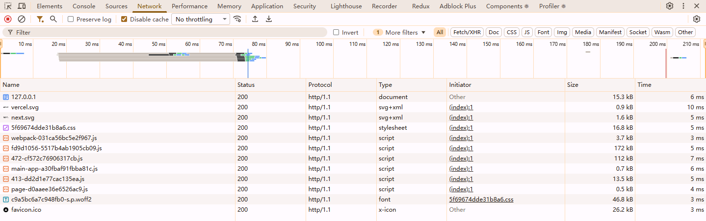
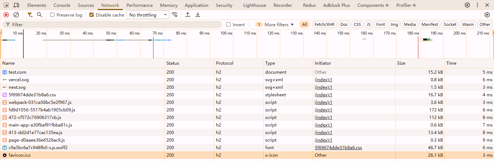
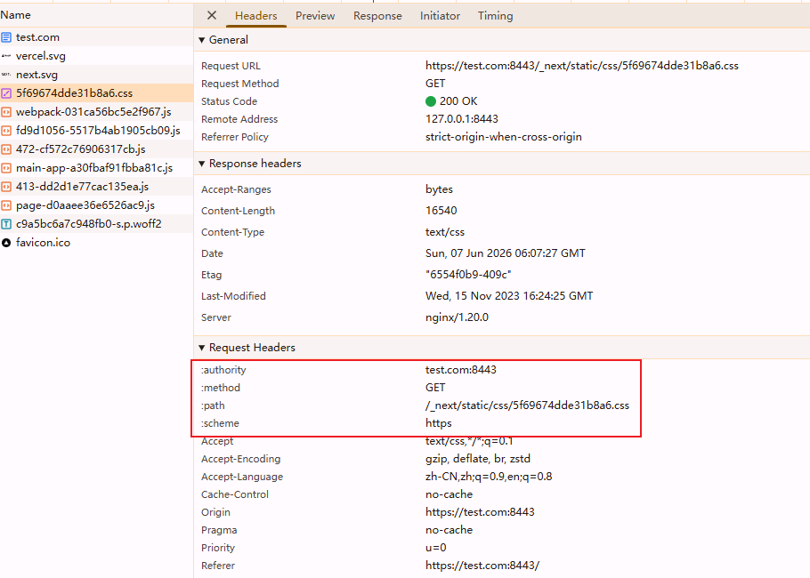

# HTTP

## 常见HTTP状态码

| 状态码 | 英文含义              | 中文简单注释                       |
| ------ | --------------------- | ---------------------------------- |
| 101    | Switch Protocol       | 协议切换（常用于 WebSocket 升级）  |
| 200    | Ok                    | 请求成功                           |
| 301    | Moved Permanently     | 永久重定向                         |
| 302    | Found                 | 临时重定向                         |
| 304    | Not Modified          | 资源未修改（走缓存）               |
| 307    | Temporary Redirect    | 临时重定向**（保持请求方法）**     |
| 400    | Bad Request           | 客户端请求错误（参数格式等）       |
| 401    | Unauthorized          | 未授权（需登录 / 认证）            |
| 403    | Forbidden             | 禁止访问（权限不足）               |
| 404    | Not Found             | 资源不存在                         |
| 429    | Too Many Request      | 请求过于频繁（限流）               |
| 500    | Internal Server Error | 服务器内部错误                     |
| 502    | Bad Gateway           | 网关错误（上游服务器返回无效响应） |
| 503    | Service Unavailable   | 服务不可用（服务器过载 / 维护）    |
| 504    | Gateway Timeout       | 网关超时（上游服务器响应超时）     |

### 307 Internal Redirect

* 307：临时重定向。与 302 类似，但要求客户端保持原来的请求方法不变（例如 POST 请求重定向后仍然用 POST，不能改为 GET）。
* Internal Redirect：表示这个重定向是浏览器内部自动触发的，而不是从服务器响应中收到的。
* HTTP 自动升级到 HTTPS（HSTS） .你访问一个 http:// 的网址，但该网站已通过 HSTS（HTTP Strict Transport Security）要求浏览器必须使用 HTTPS。 
* → 浏览器内部将请求从 http:// 重定向到 https://，并在开发者工具里显示 307 Internal Redirect


## HTTP 1.1 vs HTTP 2


【http1.1】Waterfall有明显排队现象



【http2】Waterfall是一条线





这些 `:` 开头的 Header（Pseudo Header）就是 HTTP/2 特有的。

在 HTTP/1.1 时代很多人会想：

```
全部合并成一个 bundle.js
```

减少请求数。

而 HTTP/2 时代：

```
拆包（Code Splitting）
```

通常更有利：

* 请求数增加问题不大
* 可以按需加载
* 利用浏览器缓存
* 首屏更快

这也是为什么：

* React → Dynamic Import
* Next.js → Chunk Splitting
* Vite → Rollup Chunk

都越来越激进地拆包。

## 请求头

### Host

```text
Host: www.example.com
```

HTTP/2 与 HTTP/3 里名字变了：

```text
:authority: www.example.com
```

### Authorization

* Basic: base64(username:password)
* Bearer: token


## 响应头


### Content-Type

| content-type             | 含义     |      |
| ------------------------ | -------- | ---- |
| text/plain               | 普通文本 |      |
| text/html, text/xml      |          |      |
| application/json         |          |      |
| application/octet-stream | 二进制流 |      |
|                          |          |      |
|                          |          |      |

### Cache-Control

#### 1. 缓存存储策略

| 指令       | 含义                                                         |
| :--------- | :----------------------------------------------------------- |
| `public`   | 任何缓存（浏览器、CDN、代理）都可以存储响应。                |
| `private`  | 只能由用户代理（浏览器）缓存，中间缓存不应存储（如用户个人信息页）。 |
| `no-store` | **完全禁止缓存**，每次请求都必须向源站获取完整响应（用于敏感数据）。 |
| `no-cache` | **必须先验证再使用**：缓存需向源站发起校验请求，若资源未过期则返回 304，否则返回新资源。 |

#### 2. 缓存过期机制

| 指令               | 含义                                                         |
| :----------------- | :----------------------------------------------------------- |
| `max-age=`         | 设置资源从请求时间起算的最大有效时长（秒）。优先级高于 `Expires` 头。 |
| `s-maxage=`        | 仅对共享缓存（如 CDN、代理）生效，覆盖 `max-age` 和 `Expires`。 |
| `must-revalidate`  | 一旦资源过期，必须回源验证，不允许使用过期资源（即使网络故障）。 |
| `proxy-revalidate` | 同 `must-revalidate`，但仅对共享缓存生效。                   |

#### 3. 其他修饰指令

| 指令                      | 含义                                                         |
| :------------------------ | :----------------------------------------------------------- |
| `immutable`               | 资源完全不会变化（如带 hash 的静态文件），即使过期也不需验证，避免携带 `If-None-Match` 浪费请求。 |
| `stale-while-revalidate=` | 允许在后台异步更新缓存的同时，返回已过期的旧资源，提升感知性能。 |
| `stale-if-error=`         | 当源站出错时（5xx），允许返回过期资源作为降级方案。          |
| `no-transform`            | 禁止代理或 CDN 对响应内容进行压缩、转码等任何修改。          |

#### 典型使用场景

1. 静态资源（带指纹，如 `app.a1b2c3.js`）

```
Cache-Control: public, max-age=31536000, immutable
```

一年过期 + 永远不需要重新验证（适合 CDN 长期缓存）。

2. 静态资源（无指纹，如 `logo.png`）

```
Cache-Control: public, max-age=86400, must-revalidate
```

一天过期，过期后需要回源验证（可配合 `ETag` / `Last-Modified` 返回 304）。

3. HTML 页面（动态内容）

```
Cache-Control: no-cache
```


每次都验证新鲜度，但资源未变化时返回 304，节省带宽。

### 4. 用户个人数据（如 `/profile`）

http

```
Cache-Control: private, max-age=600
```


只在浏览器缓存 10 分钟，不允许中间代理存储。

### 5. 高度敏感数据（订单、支付）

http

```
Cache-Control: no-store
```


完全禁止任何形式的缓存。

### 6. 性能优化（异步更新）

http

```
Cache-Control: max-age=60, stale-while-revalidate=86400
```


资源在 60 秒内新鲜；过期后 1 天内，先返回旧内容，同时后台去更新缓存。

## 与其他缓存头的交互

* **`Expires`**：HTTP/1.0 的绝对时间，优先级低于 `max-age`。
* **`Pragma: no-cache`**：HTTP/1.0 的兼容指令，效果近似 `Cache-Control: no-cache`，但不够精确。
* **`ETag` / `Last-Modified`**：用于 `no-cache` 或过期后的**再验证**，返回 `304 Not Modified`。


### Date

使用格林威治标准时间。

```
Date: Sun, 07 Jun 2026 07:56:10 GMT
```

作用：

* 配合 `Cache-Control` 中的 `max-age` 指令，缓存服务器计算资源是否过期的方式是：`Date` 时间 + `max-age` ≤ 当前时间，若成立则判定资源“新鲜”，可直接复用。
* 服务器生成的 `Set-Cookie` 中如果包含 `Expires` 属性，浏览器会参考 `Date` 来判定 cookie 是否已失效。

### Keep-alive

```text
Connection: Keep-Alive
Keep-Alive: timeout=5, max=1000
```

在一个 TCP 连接上发送多个 http 请求，避免重开 TCP 连接的开销


### 服务器

* Server
* X-Powerd-By
