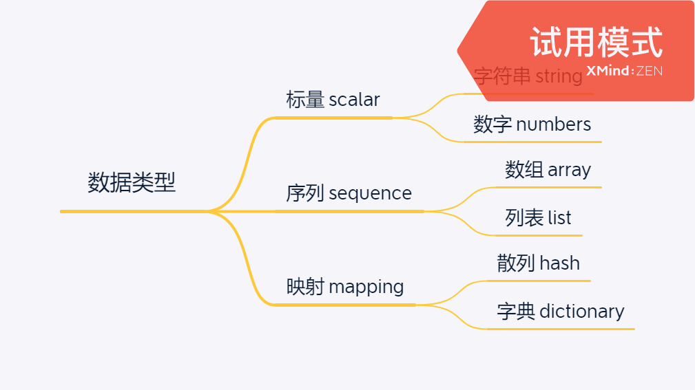

# 数据交换格式

## 数据结构

> There are many kinds of data structures, but they can all be adequately represented with three basic primitives: mappings (hashes/dictionaries), sequences (arrays/lists) and scalars (strings/numbers). 

## 数据格式

### [XML](https://www.xml.com/)

eXtensible Markup Language

应用举例：
* Maven pom.xml
* Spring ApplicationContext.xml

### [JSON](https://www.json.org/json-en.html)

JavaScript Object Notation

应用举例：
* npm package.json

### [YAML](https://yaml.org/)

YAML Ain't Markup Language

应用举例：
* SpringBoot application.yaml

### [Toml](https://toml.io/en/)

应用举例：
* rust的包描述文件 Cargo.toml

## Reference

* https://www.ruanyifeng.com/blog/2009/05/data_types_and_json.html
* https://yaml.org/spec/1.2.2/#chapter-1-introduction-to-yaml
