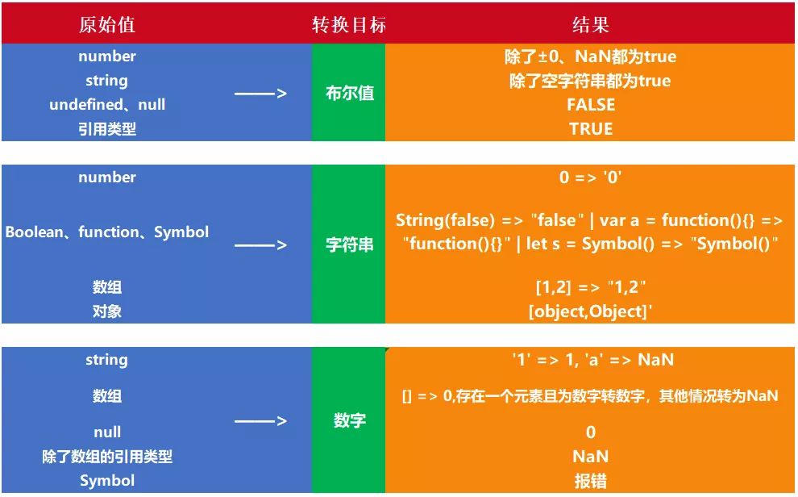

# JavaScript类型转换



## to boolean

* 其他类型转布尔值，可以用 `Boolean()` 函数或者两次取反 `!!`
* 除了下面六个值被转为false，其他值都视为true。
	* undefined
	* null
	* false
	* 0
	* NaN
	* `""` or `''`（空字符串）
## to number

```js
// undefined是一个表示"此处无定义"的原始值，转为数值时为NaN
console.log(Number(undefined))  // NaN
console.log(5 + undefined) // NaN

// null是一个表示“空”的对象，转为数值时为0
console.log(Number(null))   // 0
console.log(5 + null) // 5

console.log(Number(false))  // 0
console.log(Number(true))   // 1

console.log(Number('')) // 0
console.log(Number('12')) // 12
console.log(Number('12aaa')) // NaN，只要字符串看上去不是一个数字，转换就失败！

// 从左到右尽可能解析出一个整数，解析不出就NaN
console.log(Number.parseInt("12aaa", 10))  // 12，最好指定基数

// 只能解析十进制数
console.log(Number.parseFloat("12.0"))  // 12，注意是整数！会尽可能转成整数
```

对象：先对对象valueOf返回值转换，如果是NaN则对对象toString返回值转换

```js
console.log(Number({})) // NaN
console.log(Number([])) // 0
console.log(Number(function (){})) // NaN

const v1 = {
  valueOf() {
    return 1;
  },
  toString() {
    return '2';
  }
}

const v2 = {
  toString() {
    return '2';
  }
}

console.log(Number(v1)) // 1
console.log(Number(v2)) // 2
```


## to string

```js
console.log(String(0))  // "0"
console.log(String(false))  // "false"
console.log(String(null))  // "null"
console.log(String(undefined))  // "undefined"
console.log(Symbol("foo"))  // Symbol(foo)

console.log(String([1, 2, 3]))  // "1,2,3"
console.log(String({a: 1, b: 2}))  // "[object Object]"
console.log(String(function () {}))  // "function () {}"
```