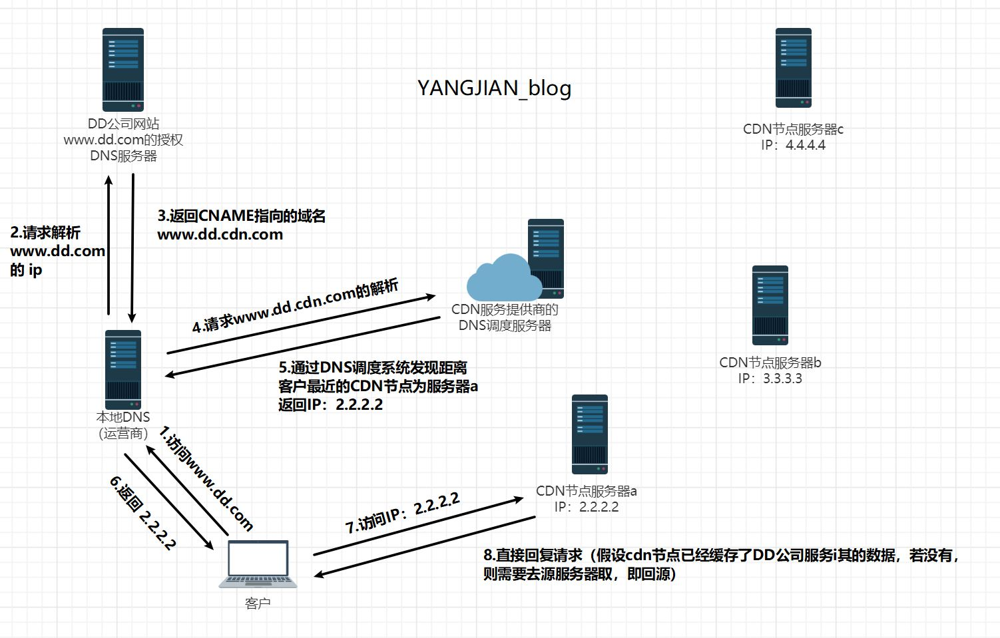

# CNAME

> A记录是将域名解析成IP，CNAME是将域名解析成另外一个域名。



------

## **1. 主要用途**

* **域名别名**：将一个子域名（如 `www.example.com`）指向另一个域名（如 `example.com` 或第三方服务域名）。
* **CDN 或云服务集成**：例如，将 `assets.yoursite.com` 指向 `your-cdn-provider.com`。
* **简化管理**：当目标域名 IP 变更时，只需修改目标域名的 A 记录，所有 CNAME 记录会自动生效。

------

## **2. 工作原理**

* **示例**：
  假设你的网站主域名是 `example.com`，而你想让 `www.example.com` 也指向同一个网站。
  可以设置一条 CNAME 记录：

```
www.example.com.  CNAME  example.com.
```

当用户访问 `www.example.com` 时，DNS 会先解析 `example.com` 的 IP 地址，再返回给用户。

* **注意**：
* CNAME 只能指向**另一个域名**，不能直接指向 IP 地址（需用 A 或 AAAA 记录）。
    * CNAME 不能与其他记录类型（如 MX、TXT）共存于同一子域名。

------

## **3. 常见应用场景**

1. **网站主域名与子域名**
    * `www.example.com` → `example.com`
    * `blog.example.com` → `第三方博客平台（如 Medium）`
2. **CDN 或云存储**
    * `static.example.com` → `xyz.cloudfront.net`（AWS CDN）
    * `images.example.com` → `storage.googleapis.com`（Google Cloud）
3. **第三方服务集成**
    * `mail.example.com` → `mailprovider.com`（企业邮箱服务）
    * `shop.example.com` → `shopify.com`（电商平台）

------


## Reference

* https://blog.csdn.net/DD_orz/article/details/100034049

