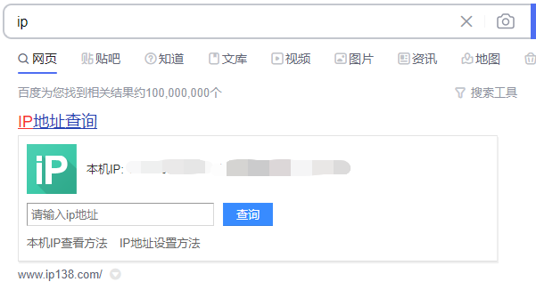
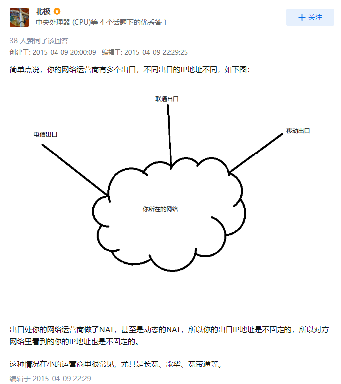

# 查询本机ip
## 局域网ip
`cmd` 输入 `ipconfig`


## 公网ip
### 1.百度

### 2.[ip.sb](https://ip.sb/)
详见[博客](https://u.sb/ip-sb/)

### 3.[ip.cn](https://ip.cn/)
### 4.[ipconfig](https://ipconfig.io/)

### 5.https://zh-hans.ipshu.com/

### 6.命令行
```shell
curl ip.sb
curl ipconfig.io
curl cip.cc
curl myip.ipip.net
```

## 为什么在不同网站查询到自己的本机公网 IP 不一样？
