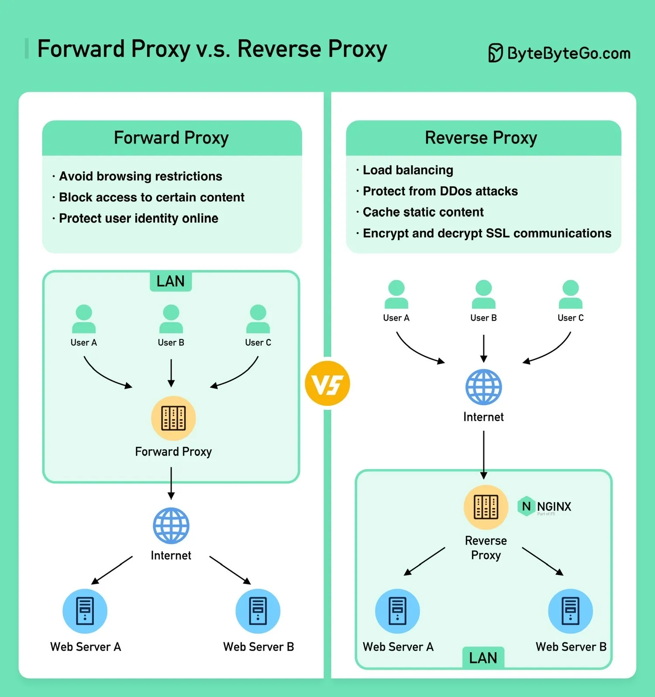
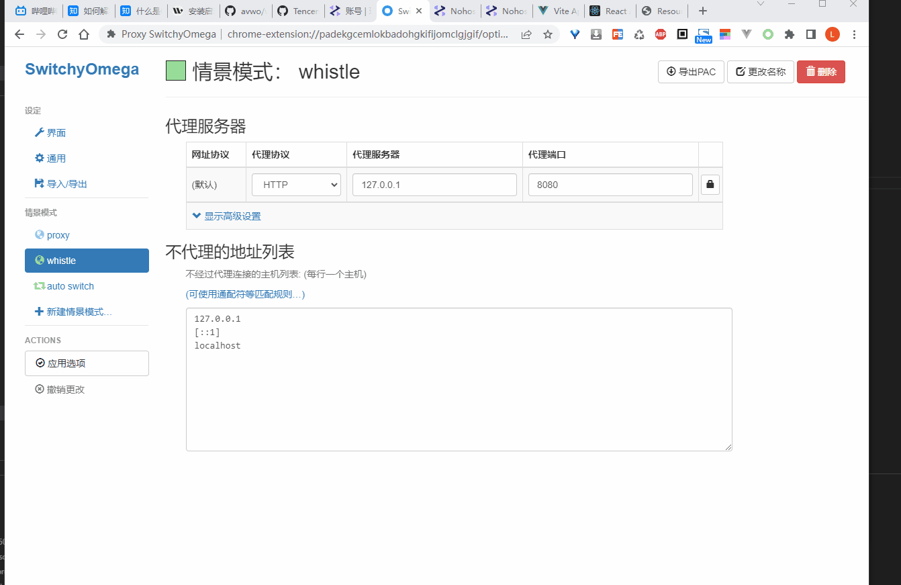

# Proxy

## Forward Proxy v.s. Reverse Proxy

## 开发调试

### [Whistle](https://wproxy.org/)

> 基于Node实现的跨平台web调试代理工具

> 查看、修改HTTP、HTTPS、Websocket的请求、响应

> 一切操作都可以通过配置实现，支持域名、路径、正则表达式、通配符、通配路径等多种匹配方式

选中一批请求：Command + Shift

* whistle手机抓包配置参考[文章](https://zhuanlan.zhihu.com/p/205089931)
* [whistle-mcp](https://github.com/7gugu/whistle-mcp)

### [nohost](https://nohost.pro/)

> 基于 Whistle 实现的环境配置与抓包调试平台，支持多账号、多独立环境

  

## Chrome 插件

* [SwitchyOmega](https://chrome.google.com/webstore/detail/proxy-switchyomega/padekgcemlokbadohgkifijomclgjgif)
