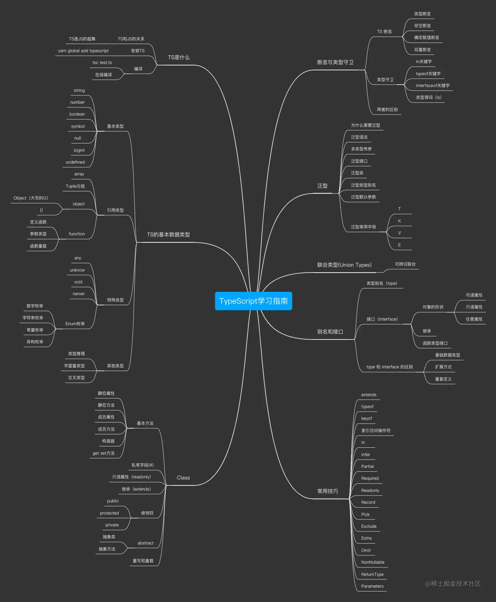
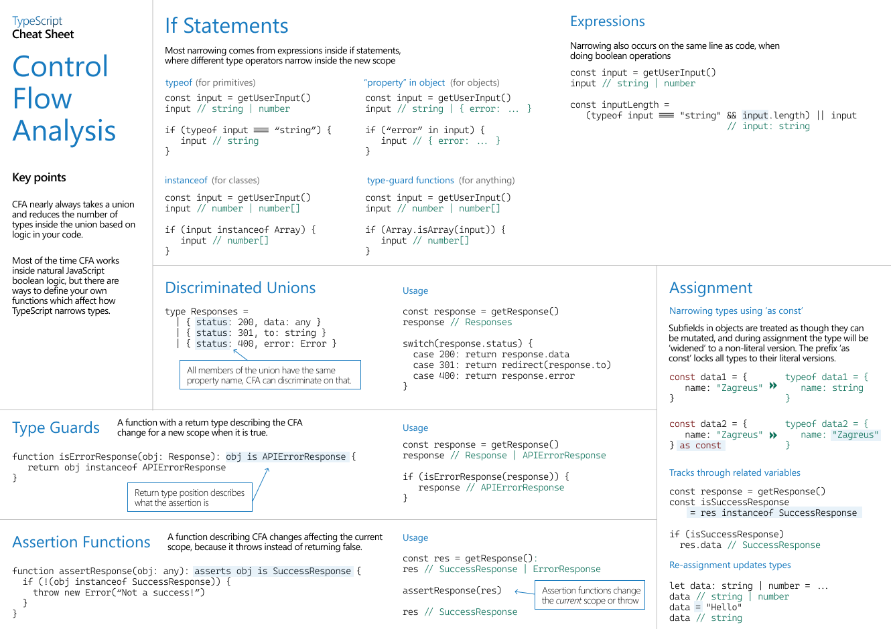

# [TypeScript](https://www.typescriptlang.org/)

思维导图来自[博文](https://juejin.cn/post/7088304364078497800)

## [cheatsheets](https://www.typescriptlang.org/cheatsheets)

### Control Flow Analysis

### Interfaces

### Types

### Classes

## Type Search

https://www.typescriptlang.org/dt/search?search=

## [declare](./declare)
