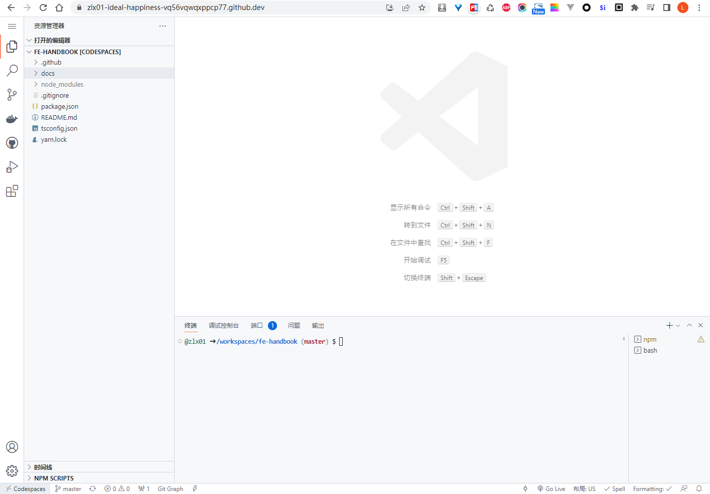

# GitHub

## 有哪些功能？

* https://github.com/features/

## Actions

* https://github.com/marketplace?type=actions
* https://github.com/marketplace/actions/build-and-push-docker-images
* https://github.com/marketplace/actions/docker-build-push-action

## Pages

* https://pages.github.com/

## github.dev

在仓库页面按下<kbd>.</kbd>在浏览器打开一个网页版vscode，可以浏览、修改、提交代码。

> The github.dev web-based editor is a lightweight editing experience that runs entirely in your browser. You can navigate files and source code repositories from GitHub, and make and commit code changes.

* https://github.com/github/dev  becomes  http://github.dev/github/dev
* https://github.dev/  redirected to http://github.dev/github/dev

## CodeSpaces

比`github.dev`更加强大，支持终端！每个月有少量的免费使用额度。

## Copilot

* 10$/month,  100\$/year

