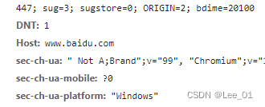
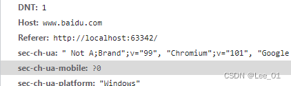
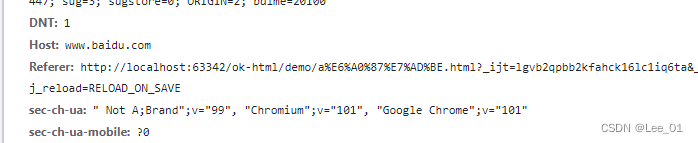

# a标签referrerpolicy、rel属性

## referrerpolicy
HTTP 头信息的referer字段，表示当前请求是从哪里来的。
> * no-referrer：不发送referer字段。
> * origin：referer字段的值是\<a>元素的origin属性，即协议 + 主机名 + 端口。
> * unsafe-url：referer字段的值是origin属性再加上路径，但不包含#片段。这种格式提供的信息最详细，可能存在信息泄漏的风险。

* no-referrer
```html
<a id="no-referrer" href="https://www.baidu.com" referrerpolicy="no-referrer" target="_self">no-referrer</a>
```


* origin
```html
<a id="origin" href="https://www.baidu.com" referrerpolicy="origin" target="_self">origin</a>
```

* unsafe-url
```html
<a id="unsafe-url" href="https://www.baidu.com" referrerpolicy="unsafe-url" target="_self">unsafe-url</a>
```



## rel

a标签target=”_blank”的安全问题

* 参考文章：[https://kebingzao.com/2020/05/14/a-target-blank/](https://kebingzao.com/2020/05/14/a-target-blank/)
* 测试地址：[https://mathiasbynens.github.io/rel-noopener/](https://mathiasbynens.github.io/rel-noopener/)
* 测试结果：未复现，现代浏览器（chrome，edge，firefox）做了限制。

个人测试代码：

a.html
```html
<ul>
  <li>
    <a href="b.html" target="_blank">访问b网站</a>
  </li>
  <li>
    <a href="b.html" target="_blank" rel="noopener">访问b网站(noopener)</a>
  </li>
  <li>
    <a href="b.html" target="_blank" rel="noreferrer">访问b网站(noreferer)</a>
  </li>
  <li>
    <a href="b.html" target="_blank" rel="noopener noreferrer">访问b网站(noopener noreferrer)</a>
  </li>
</ul>
```
b.html
```html
<body>
  <p>这里是b网站</p>
  <script>
    console.log('window.opener', window.opener)
    if (window.opener) {
      window.opener.location.href = 'evil.html';
    }
  </script>
</body>
```
evil.html
```html
<body>
  <p>
    这里有好康的！
  </p>
</body>
```

## Reference

https://wangdoc.com/javascript/elements/a.html
