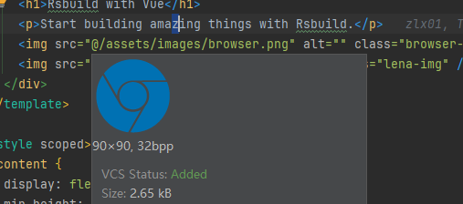
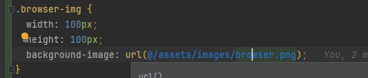
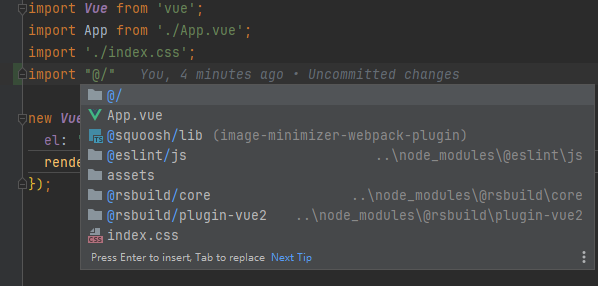
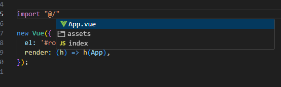
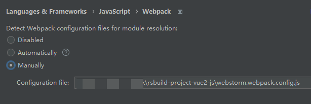

# 配置webstorm/vscode识别@符号（路径别名）

## 目标效果

1.能识别资源路径，并且**Ctrl+鼠标左键**（或**Ctrl+B**）能跳转





亲测vscode无法实现以上效果

2.能自动补全路径





## webstorm/vscode js项目配置方法

在项目根目录新增 `jsconfig.json` 文件

```json
{
  "compilerOptions": {
    "baseUrl": "./",
    "paths": {
      "@/*": ["src/*"]
    }
  },
  "exclude": ["node_modules", "dist"]
}
```

## webstorm js项目配置方法（webpack）

在根目录新增 `webstorm.webpack.config.js` 文件

```js
const path = require('path');

module.exports = {
  context: path.resolve(__dirname, './'),
  resolve: {
    extensions: ['.js', '.vue'],
    alias: {
      '@': path.resolve(__dirname, './src')
    }
  }
}
```

WebStorm配置




## Reference

* https://blog.crazyming.com/note/2283/
