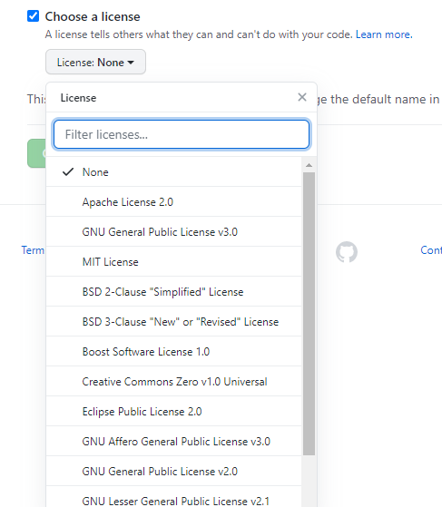

# 开源许可证
> A software license tells others what they can and can't do with your source code. For your repository to truly be open source, you'll need to license it so that others are free to use, change, and distribute the software.

> 版权法默认禁止共享，也就是说，没有许可证的软件，就等同于保留版权，虽然开源了，用户只能看源码，不能用，一用就会侵犯版权。所以软件开源的话，必须明确地授予用户开源许可证。

## 一图胜千言

## 宽松式许可证

> * 没有使用限制
> * 没有担保
> * 披露要求（notice requirement）
> * 用户可以修改代码后闭源
> * 举例：[BSD](https://zh.wikipedia.org/wiki/BSD%E8%AE%B8%E5%8F%AF%E8%AF%81)、[MIT](https://zh.wikipedia.org/wiki/MIT%E8%A8%B1%E5%8F%AF%E8%AD%89)、Apache 2

## Copyleft

> * 如果分发二进制格式，必须提供源码
> * 修改后的源码，必须与修改前保持许可证一致
> * 不得在原始许可证以外，附加其他限制
> * 修改后的 Copyleft 代码不得闭源
> * 举例：Affero GPL (AGPL)、[GPL](https://zh.wikipedia.org/wiki/GNU%E9%80%9A%E7%94%A8%E5%85%AC%E5%85%B1%E8%AE%B8%E5%8F%AF%E8%AF%81)、LGPL、Mozilla（MPL）

## GPL许可证

> * 自由软件基金会
> * 允许任何人观看、修改，并散播程序软件里的原始程序码，唯一条件是如果你要发布修改后的版本就要连源代码一起公布

## 开源软件如何挣钱？
* 个人：靠捐赠，或项目火了以后大公司资助
* 企业：靠增值服务

## GitHub项目设置开源许可证
[how to choose](https://choosealicense.com/)

## 参考博客

http://www.ruanyifeng.com/blog/2017/10/open-source-license-tutorial.html

http://www.ruanyifeng.com/blog/2011/05/how_to_choose_free_software_licenses.html
