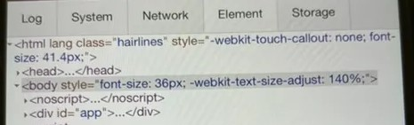

# 移动端适配问题


* 1像素分割线/边框，详见[博文](https://segmentfault.com/a/1190000007604842)
* ios自动密码填充导致输入账号时键盘闪烁，详见[博文](https://juejin.cn/post/7083804990925438983)
* iOS safari click事件300ms延迟
* 滚动穿透和滚动溢出
* iOS页面滑动卡顿
* android手机软键盘将页面顶起来、收起未回落问题
* [emoji编码](https://github.com/gzu-liyujiang/UnicodeEmoji/blob/master/emoji.json)
* 微信中的emoji在Android和iOS下表现一致，参考[社区问答](https://developers.weixin.qq.com/community/develop/doc/000604b75fc71889bd89d4c1a5b400)

## 安全区适配

* iPhone安全区适配，[viewport配置](https://stephenradford.me/removing-the-white-bars-in-safari-on-iphone-x/)

安全区变量

```css
:root {
  --nuxt-devtools-safe-area-top: env(safe-area-inset-top, 0px);
  --nuxt-devtools-safe-area-right: env(safe-area-inset-right, 0px);
  --nuxt-devtools-safe-area-bottom: env(safe-area-inset-bottom, 0px);
  --nuxt-devtools-safe-area-left: env(safe-area-inset-left, 0px);
}
```


## 微信设置字体大小导致字体被强制缩放



阻止这一行为：


```css
body {
  -webkit-text-size-adjust: 100% !important;
}
```

