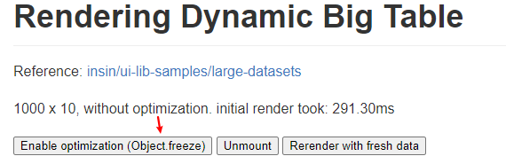

# 网页性能优化

## 检测工具

* lighthouse
* https://pagespeed.web.dev/

## 性能指标

* https://web.dev/lcp/

## 优化技巧

### Object.freeze

### combine multiple js files into one

把多个js文件合并成一个文件，减少http请求次数，提高加载速度。

vue.runtime.js  vue-router.js vuex.js

走cdn缓存

