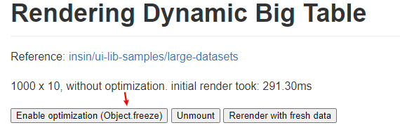

# 网页性能优化

## 检测工具

* lighthouse
* https://pagespeed.web.dev/

## 性能指标

* https://web.dev/lcp/

## 优化技巧

### Object.freeze

### combine multiple js files into one

把多个js文件合并成一个文件，减少http请求次数，提高加载速度。

vue.runtime.js  vue-router.js vuex.js

走cdn缓存

因此 gzip 用于 HTTP 文件传输中，比如 JS、CSS 等，但一般不会压缩图片。在 HTTP Response 报文中，用 Content-Encoding 指明使用 gzip 压缩

html设置协商缓存
静态资源 hash + 强缓存
