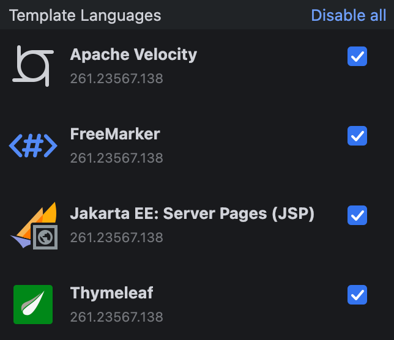

# Template Languages

## JavaScript / Node.js

- [ejs](https://github.com/mde/ejs)
- [Pug](https://github.com/pugjs/pug)
- [Mustache.js](https://github.com/janl/mustache.js)

## Java

- [JSP (JavaServer Pages)](https://www.oracle.com/java/technologies/jspt.html)
- [Thymeleaf](https://www.thymeleaf.org/)
- [FreeMarker](https://freemarker.apache.org/)
- [Velocity](https://velocity.apache.org/)

