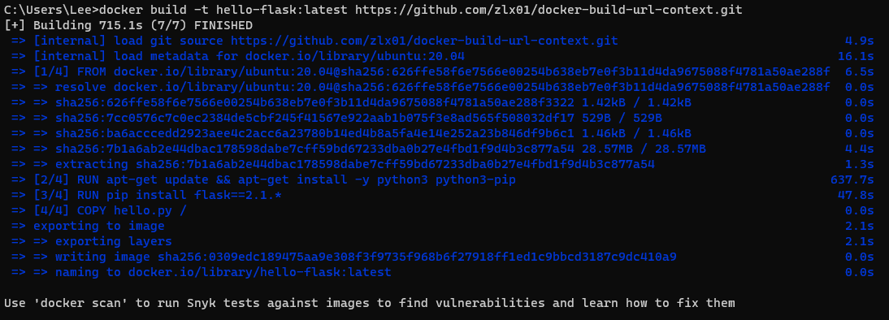
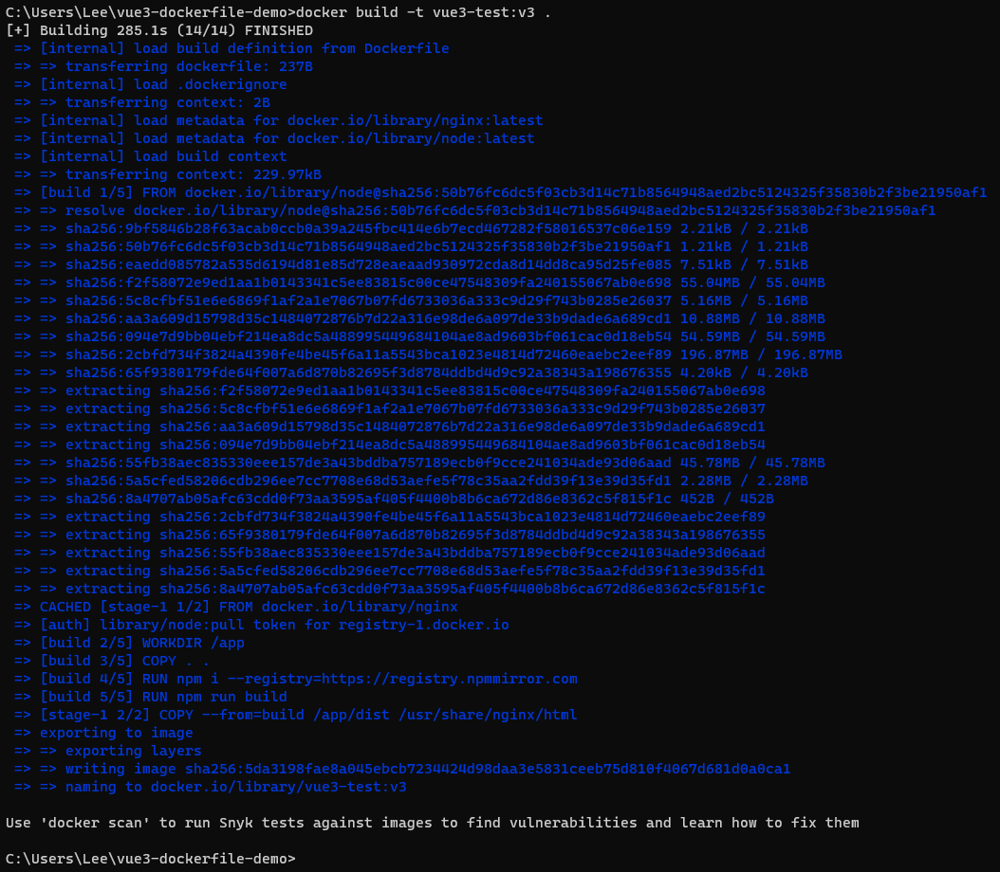
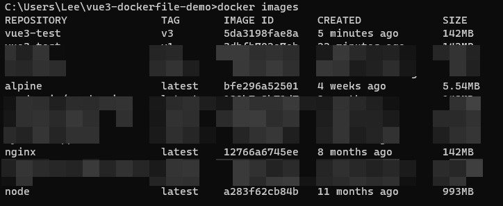
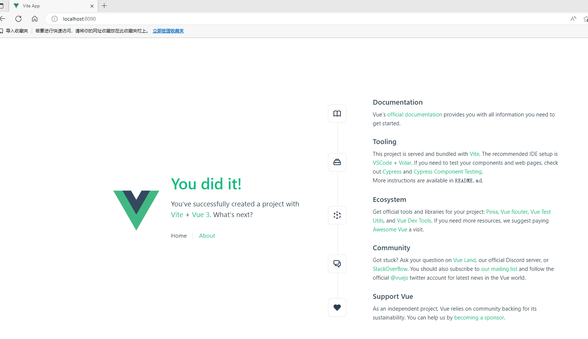
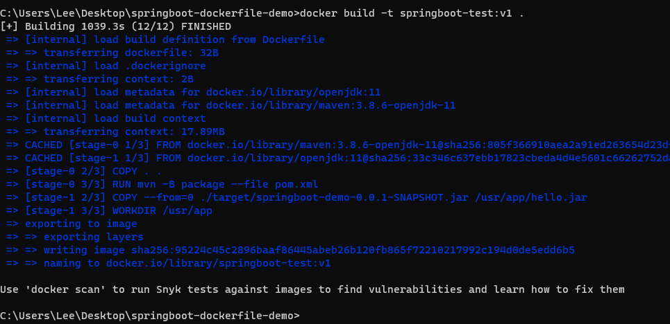
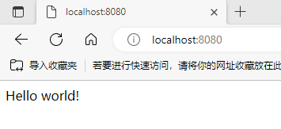

# Docker Build

```bash
docker build

# since 18.09, backward compatible with docker build. default builder
docker buildx build
```

## [Dockerfile](https://docs.docker.com/engine/reference/builder/)

> Docker builds images by reading the instructions from a Dockerfile. This is a text file containing instructions that adhere to a specific format needed to assemble your application into a container image.

> Docker images consist of **read-only layers**, each resulting from an instruction in the Dockerfile. Layers are stacked sequentially and each one is a delta representing the changes applied to the previous layer.

Dockerfile 是一个描述如何创建 Docker 镜像所需步骤的文本文件。由一系列指令组成。

1. docker从基础镜像运行一个容器
2. 执行一条指令并对容器作出修改
3. 执行类似docker commit的操作提交一个新的镜像层
4. docker再基于刚提交的镜像运行一个新容器
5. 执行dockerfile中的下一条指令直到所有指令都执行完成

```bash
# 使用当前目录的Dockerfile创建镜像
docker build -t myimage1:latest .

# 使用指定目录的Dockerfile创建镜像
docker build -t myimage2:latest -f path/to/Dockerfile .
```

the most common types of instructions:

| Instruction                                                  | Description                                                  |
| ------------------------------------------------------------ | ------------------------------------------------------------ |
| [From \<image>](https://docs.docker.com/engine/reference/builder/#from) | Defines a base for your image.                               |
| [RUN \<command>](https://docs.docker.com/engine/reference/builder/#run) | Executes any commands in a new layer on top of the current image and commits the result. `RUN` also has a shell form for running commands. |
| [WORKDIR \<directory>](https://docs.docker.com/engine/reference/builder/#workdir) | Sets the working directory for any `RUN`, `CMD`, `ENTRYPOINT`, `COPY`, and `ADD` instructions that follow it in the Dockerfile. |
| [COPY \<src> \<dest>](https://docs.docker.com/engine/reference/builder/#copy) | Copies new files or directories from `` and adds them to the filesystem of the container at the path ``. |
| [CMD \<command>](https://docs.docker.com/engine/reference/builder/#cmd) | Lets you define the default program that is run once you start the container based on this image. Each Dockerfile only has one `CMD`, and only the last `CMD` instance is respected when multiple exist. |

## 指令
### `FROM`


```bash
# tag默认latest
FROM [--platform=<platform>] <image> [AS <name>]
FROM [--platform=<platform>] <image>[:<tag>] [AS <name>]
FROM [--platform=<platform>] <image>[@<digest>] [AS <name>]

FROM openjdk:11-jre
```

> The `FROM` instruction initializes a new build stage and sets the [*Base Image*](https://docs.docker.com/glossary/#base-image) for subsequent instructions. As such, a valid `Dockerfile` must start with a `FROM` instruction.

> * Optionally a name can be given to a new build stage by adding `AS name` to the `FROM` instruction. The name can be used in subsequent `FROM` and `COPY --from=` instructions to refer to the image built in this stage.

### Run

一条指令会在当前镜像的最顶层执行，并提交执行结果生成新的镜像层，供下一步使用。可以用`&&` 将多条指令合并成一个，指令太长可以用 `\` 换行。

RUN has 2 forms:

* `RUN ` (*shell* form, the command is run in a shell, which by default is `/bin/sh -c` on Linux or `cmd /S /C` on Windows)
* `RUN ["executable", "param1", "param2"]` (*exec* form)

```bash
RUN /bin/bash -c 'echo hello'
# equivalent to
RUN ["/bin/bash", "-c", "echo hello"]

RUN apt-get update \
 && apt-get install vim
```

> Unlike the *shell* form, the *exec* form does not invoke a command shell. This means that normal shell processing does not happen.

```bash
# will not do variable substitution on $HOME
RUN [ "echo", "$HOME" ]

# correct
RUN [ "sh", "-c", "echo $HOME" ]
```

### COPY

```bash
COPY [--chown=<user>:<group>] <src>... <dest>

# This latter form is required for paths containing whitespace
COPY [--chown=<user>:<group>] ["<src>",... "<dest>"]
```

> The `<src>` path must be inside the *context* of the build。只能将复制本地文件至镜像内。

> `--from`参数用于在多阶段构建中，从前置构建或其他镜像复制文件。

### ADD

```bash
ADD [--chown=<user>:<group>] [--checksum=<checksum>] <src>... <dest>

# The latter form is required for paths containing whitespace.
ADD [--chown=<user>:<group>] ["<src>",... "<dest>"]
```

> If `<src>` is a *local* tar archive in a recognized compression format (identity, gzip, bzip2 or xz) then it is unpacked as a directory. Resources from *remote* URLs are **not** decompressed.

### CMD

容器启动时运行的命令，只能有一条，多条的话最后一条生效

The `CMD` instruction has three forms:

* `CMD ["executable","param1","param2"]` (*exec* form, this is the preferred form)
* `CMD ["param1","param2"]` (as *default parameters to ENTRYPOINT*). If `CMD` is used to provide default arguments for the `ENTRYPOINT` instruction, both the `CMD` and `ENTRYPOINT` instructions should be specified with the JSON array format.
* `CMD command param1 param2` (*shell* form, execute in `/bin/sh -c`)

### ENTRYPOINT

容器启动时运行的命令，只能有一条，多条的话最后一条生效。使用`docker run`命令创建容器时，`ENTRYPOINT`不能被覆盖，只能设置额外参数。

```bash
ENTRYPOINT ["executable", "param1", "param2"]

ENTRYPOINT command param1 param2

ENTRYPOINT ["java", "-jar", "/application.jar"]
```

举例1

```bash
FROM ubuntu
ENTRYPOINT ["top", "-b"]
CMD ["-c"]
```

```bash
docker run -it --rm --name test  top -H
```

```bash
# 最终执行
top -b -H
```

举例2

```bash
FROM ubuntu
ENTRYPOINT exec top -b
```

```bash
docker run -it --rm --name test top
```

```bash
# 最终执行
top -b
```

### CMD vs ENTRYPOINT

> 1. Dockerfile should specify at least one of `CMD` or `ENTRYPOINT` commands.
> 2. `ENTRYPOINT` should be defined when using the container as an executable.
> 3. `CMD` should be used as a way of defining default arguments for an `ENTRYPOINT` command or for executing an ad-hoc command in a container.
> 4. `CMD` will be overridden when running the container with alternative arguments.

> 1. 如果Docker镜像的用途是运行应用程序或服务，比如运行一个MySQL，应该优先使用Exec格式的ENTRYPOINT指令。CMD可为ENTRYPOINT提供额外的默认参数，同时可利用docker run命令行替换默认参数。
> 2. 如果想为容器设置默认的启动命令，可使用CMD指令。用户可在docker run命令行中替换此默认命令。

|                                | No ENTRYPOINT              | ENTRYPOINT exec_entry p1_entry | ENTRYPOINT [“exec_entry”, “p1_entry”]          |
| :----------------------------- | :------------------------- | :----------------------------- | :--------------------------------------------- |
| **No CMD**                     | *error, not allowed*       | /bin/sh -c exec_entry p1_entry | exec_entry p1_entry                            |
| **CMD [“exec_cmd”, “p1_cmd”]** | exec_cmd p1_cmd            | /bin/sh -c exec_entry p1_entry | exec_entry p1_entry exec_cmd p1_cmd            |
| **CMD exec_cmd p1_cmd**        | /bin/sh -c exec_cmd p1_cmd | /bin/sh -c exec_entry p1_entry | exec_entry p1_entry /bin/sh -c exec_cmd p1_cmd |

### ENV

```bash
ENV <key>=<value> ...

ENV MY_NAME="John Doe"
ENV MY_DOG=Rex\ The\ Dog
ENV MY_CAT=fluffy
```

> You can view the values using `docker inspect`, and change them using `docker run --env <key>=<value>`.

### VOLUME

> The `VOLUME` instruction creates a mount point with the specified name and marks it as holding externally mounted volumes from native host or other containers.

```bash
VOLUME ["/data"]

FROM alpine
RUN mkdir /myvol
RUN echo "hello world" > /myvol/greeting
VOLUME /myvol
```

### WORKDIR

> The `WORKDIR` instruction sets the working directory for any `RUN`, `CMD`, `ENTRYPOINT`, `COPY` and `ADD` instructions that follow it in the `Dockerfile`.

```bash
WORKDIR /path/to/workdir
```

### ARG

> The `ARG` instruction defines a variable that users can pass at build-time to the builder with the `docker build` command using the `--build-arg <varname>=<value>` flag.

```bash
ARG <name>[=<default value>]
```
example: https://docs.npmjs.com/docker-and-private-modules

```bash
FROM node

ARG NPM_TOKEN  
COPY .npmrc .npmrc  
COPY package.json package.json  
RUN npm install  
RUN rm -f .npmrc

# Add your source files
COPY . .  
CMD npm start
```

.npmrc
```text
//registry.npmjs.org/:_authToken=${NPM_TOKEN}
```
```bash
docker build --build-arg NPM_TOKEN=${NPM_TOKEN} .
```

### EXPOSE

```bash
# protocol默认tcp
EXPOSE <port> [<port>/<protocol>...]

EXPOSE 8080
EXPOSE 6379/tcp 53/udp
```

### Other instructions

* LABEL：adds metadata to an image.

* USER：指定之后的 RUN、CMD 和 ENTRYPOINT 指令执行使用的用户


## [Build context](https://docs.docker.com/build/building/context/)

### path context

对于 `.`，旧的构建工具会把整个当前目录暴露给daemon，而对于BuildKit，只会暴露指令（例如COPY）使用到的路径。可以用`dockerignore`排除某些目录（例如node_modules）

### URL context

[git repository](https://github.com/zlx01/docker-build-url-context)

```bash
docker build -t hello-flask:latest https://github.com/zlx01/docker-build-url-context.git
```


## [multi-stage builds](https://docs.docker.com/build/building/multi-stage/)

> With multi-stage builds, you use multiple `FROM` statements in your Dockerfile. Each `FROM` instruction can use a different base, and each of them begins a new stage of the build. You can selectively copy artifacts from one stage to another, leaving behind everything you don’t want in the final image.

举例：

* 在node镜像中打包vue项目，把产物复制到nginx镜像中
* 在maven镜像中springboot项目，把产物复制到jre镜像中

### vue

```bash
FROM node as build

WORKDIR /app
COPY . .

RUN npm i --registry=https://registry.npmmirror.com

RUN npm run build

FROM nginx
COPY --from=build /app/dist /usr/share/nginx/html

EXPOSE 80
```
```bash
docker build -t vue3-test:v3 .
```

可以看到本地已经打包好镜像了，镜像大小和nginx接近，如果把node也包括进来，镜像竟然要达到接近1000MB，



跑起来看看
```bash
docker run -d -p 8090:80 vue3-test:v3
```


### springboot

```bash
FROM maven:3.8.6-openjdk-11

COPY . .

RUN mvn -B package --file pom.xml

FROM openjdk:11

COPY --from=0 ./target/springboot-demo-0.0.1-SNAPSHOT.jar /usr/app/hello.jar
WORKDIR /usr/app

EXPOSE 8080

ENTRYPOINT ["java", "-jar", "hello.jar"]
```

```bash
docker run -d -p 8080:8080 springboot-test:v1
```


## Best Practice

```dockerfile
FROM ubuntu
RUN apt-get update
RUN apt-get install -y curl
```
再安装一个wget，`apt-get update`会有缓存，curl可能安装到过时的版本
```dockerfile
FROM ubuntu
RUN apt-get update
RUN apt-get install -y curl wget
```

```dockerfile
FROM ubuntu
# 最好是每次都update，同时也能减少镜像层数，减少包的体积
RUN apt-get update && apt-get install -y curl
```
