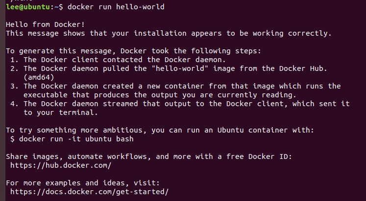
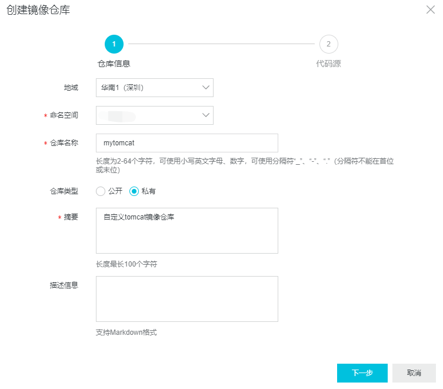
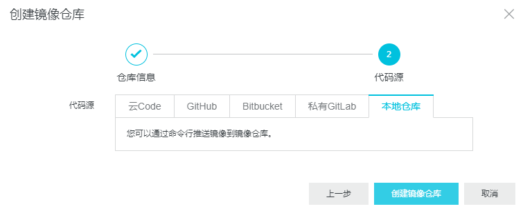
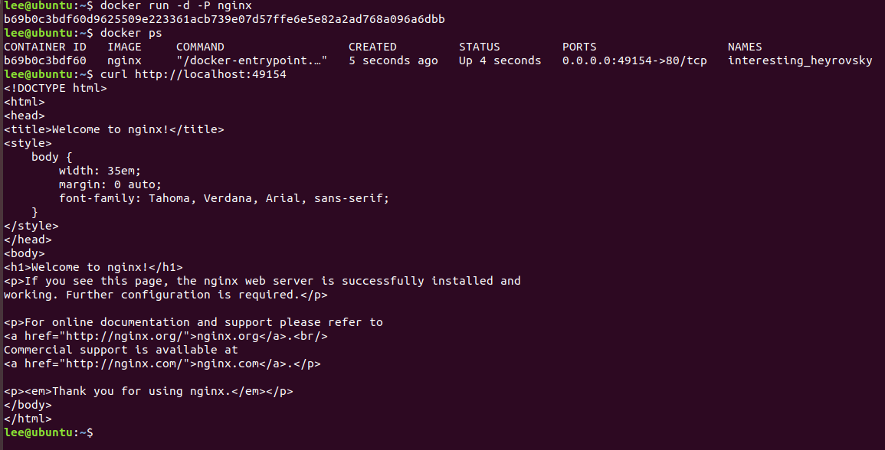

# Docker Command

### 小试牛刀
```bash
# 查看docker版本
docker -v
docker --version
# 查看帮助
docker --help
# 永远的Hello World
docker run hello-world
```


### 镜像操作

#### 查看本地已有的镜像
```bash
docker images
-a :列出本地所有的镜像（含中间映像层）
-q :只显示镜像ID
--digests :显示镜像的摘要信息
--no-trunc :显示完整的镜像信息
```
#### 查找镜像
```bash
# 没有指定TAG时，默认为latest标签
# 如果获取到的镜像比之前拉取的新，原先的镜像tag会变成none
docker search NAME:[TAG] 
--no-trunc : 显示完整的镜像描述
-s : 列出收藏数不小于指定值的镜像。
--automated : 只列出 automated build类型的镜像

# for example
docker search mysql
```

#### 拉取镜像
```bash
docker pull NAME:[TAG]
docker pull mysql	# 拉取mysql镜像，标签默认latest
docker pull mysql:tag	# 拉取指定tag的mysql镜像
```

#### 删除镜像
```bash
docker rmi image-id	# 通过镜像ID删除镜像，这种方式失败的话用镜像标签
docker rmi mysql:tag # 通过镜像标签删除镜像
# 如果一个镜像对应了多个tag，只有当最后一个tag被删除时，镜像才被真正删除
docker rmi -f 镜像ID/镜像名
docker rmi -f 镜像名1:TAG 镜像名2:TAG 
docker rmi -f $(docker images -qa)	# 删除全部
```

#### 更改镜像名和标签
```bash
docker tag NAME[:tag] NEW_NAME[:tag]
docker tag 镜像id NEW_NAME[:tag]
```

#### 查看镜像详情
```bash
docker inspect 镜像名  # 查看镜像详细信息

docker history <image> # 显示镜像的构建历史，即Dockerfile的执行过程
```

#### 提交镜像
```bash
docker commit提交容器副本使之成为一个新的镜像
docker commit -m=“提交的描述信息” -a=“作者” 容器ID 要创建的目标镜像名:[标签名] -p=true 提交时暂停容器运行
```

#### 导入导出镜像
```bash
docker save -o xxx.tar  容器:标签或容器id	# 保存容器
docker load < xxx.tar 	# 载入容器
```

#### 将本地的镜像上传远程镜像仓库
* 需要先登录Docker远程镜像仓库，默认登录官方仓库：DockerHub
```bash
docker login # 然后输入账号密码
docker push 镜像名:标签
docker logout # 登出
```
* 也可以使用阿里云镜像服务
  
  


```bash
# 推送镜像
$ sudo docker login --username=xxx registry.cn-shenzhen.aliyuncs.com
$ sudo docker tag [ImageId] registry.cn-shenzhen.aliyuncs.com/xxx/yyy:[镜像版本号]
$ sudo docker push registry.cn-shenzhen.aliyuncs.com/xxx/yyy:[镜像版本号]
# 拉取镜像
$ sudo docker pull registry.cn-shenzhen.aliyuncs.com/xxx/yyy:[镜像版本号]
```

### 容器操作
#### docker run
```bash
docker run [options] image-name
# --name container-name，为容器起个名字，必须唯一
# -i 打开容器的标准输入
# -t 为容器分配一个命令行虚拟终端，centos默认/bin/bash
# -d 后台运行
# -p 主机端口:容器端口
# -P Publish all exposed ports to random ports
# --rm 容器退出之后销毁
```

```bash
# 服务类后台运行
docker run -d -p 80:80 nginx
docker run -d -P nginx
# 工具类打开shell窗口
docker run -it -rm busybox

# exit之后容器还在
docker run -it alpine

# exit之后容器销毁
docker run --rm -it alpine
```


#### 基本命令
```bash
docker ps	# 查看正在运行的容器
docker ps -a # 查看所有容器，包括运行和停止

docker start container-name/container-id	# 启动一个已停止的容器
docker stop container-name/container-id	# 停止正在运行的容器
docker restart container-name/container-id	# 重启指定容器

docker pause container-id # 处于暂停状态的容器不会占用CPU资源
docker unpause container-id
docker kill container-name/container-id	# 强制停止指定容器

docker rm container-id	# 删除指定容器，必须先停止才能删除，-f可以强制删除
docker rm -v $(docker ps -aq -f status=exited)

docker rename container-id new-container-name	# 容器重命名

docker top 容器ID	# 查看容器内运行的进程
docker inspect 容器ID	# 查看容器内部细节

docker logs container-name/container-id	# 查看容器日志
docker logs -f -t --tail 容器ID
# -t 是加入时间戳
# -f 跟随最新的日志打印
# --tail 数字 显示最后多少条
```

#### 进入容器
```bash
# 重新进入容器启动命令的终端
# 当多个窗口同时使用该命令进入该容器时，所有的窗口都会同步显示。如果有一个窗口阻塞了，那么其他窗口也无法再进行操作。
docker attach container-id

# 重新正在后台运行的容器，并打开新的终端（推荐）
docker exec -it container-id /bin/bash
```
#### 退出容器
```bash
exit	# 容器停止退出
Ctrl+P and Ctrl+Q	# 容器不停止退出
```

#### 容器和主机之间复制文件
```bash
Usage:	docker cp [OPTIONS] CONTAINER:SRC_PATH DEST_PATH|-
	docker cp [OPTIONS] SRC_PATH|- CONTAINER:DEST_PATH

Copy files/folders between a container and the local filesystem

Use '-' as the source to read a tar archive from stdin
and extract it to a directory destination in a container.
Use '-' as the destination to stream a tar archive of a
container source to stdout.

Options:
  -a, --archive       Archive mode (copy all uid/gid information)
  -L, --follow-link   Always follow symbol link in SRC_PATH

```

#### 导入导出容器快照
```bash
docker export CONTAINER ID > xxx.tar
cat docker/ubuntu.tar | docker import - test/ubuntu:v1
```

#### 容器数据卷

* 容器数据持久化

```bash
# 两个目录如果不存在，会自动创建
docker run -it -v /宿主机绝对路径目录:/容器内目录 镜像名
# 两个目录的数据改动会实时同步
# 容器退出后，主机修改的数据会在容器重新启动后同步

# 查看数据卷是否挂载成功
docker inspect 容器ID
```

* 容器间传递共享 --volumes-from
```bash
docker run -it --name dc02 --volumes-from dc01 lee/centosfromfile
```


