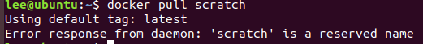
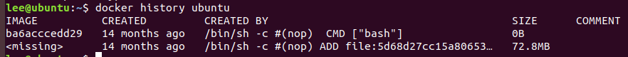
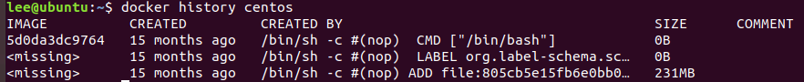
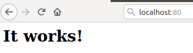
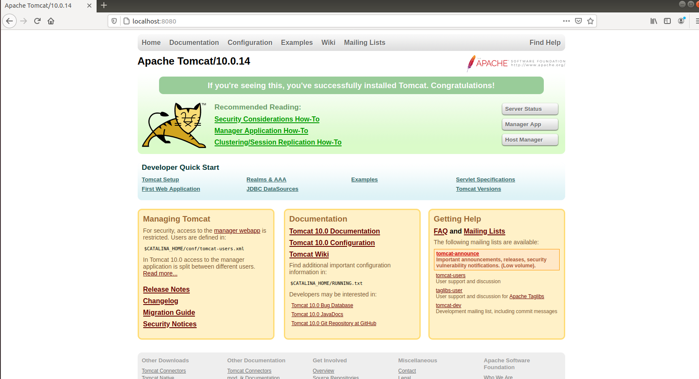
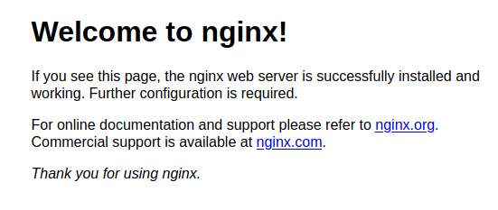

# Docker Images Explore

## [scratch](https://hub.docker.com/_/scratch)

> an explicitly empty image, especially for building images "FROM scratch"

> You can use Docker’s reserved, minimal image, `scratch`, as a starting point for building containers. Using the `scratch` “image” signals to the build process that you want the next command in the `Dockerfile` to be the first filesystem layer in your image.

> While `scratch` appears in Docker’s repository on the hub, you can’t pull it, run it, or tag any image with the name `scratch`. Instead, you can refer to it in your `Dockerfile`. For example, to create a minimal container using `scratch`:

>  A **base image** has no parent image specified in its Dockerfile. It is created using a Dockerfile with the `FROM scratch` directive.



## [hello-world](https://hub.docker.com/_/hello-world)

* https://github.com/docker-library/hello-world

```dockerfile
FROM scratch
COPY hello /
CMD ["/hello"]
```

## [alpine](https://hub.docker.com/_/alpine)

> A minimal Docker image based on Alpine Linux with a complete package index and only 5 MB in size!

```dockerfile
FROM scratch
ADD alpine-minirootfs-20221110-x86_64.tar.gz /
CMD ["/bin/sh"]
```

**minirootfs**

## [ubuntu](https://hub.docker.com/_/ubuntu)

```dockerfile
FROM scratch
ADD ubuntu-bionic-oci-amd64-root.tar.gz /
CMD ["bash"]
```



## [centos](https://hub.docker.com/_/centos)

```dockerfile
FROM scratch
ADD centos-7-x86_64-docker.tar.xz /

LABEL xxxxxx

CMD ["/bin/bash"]
```




## [busybox](https://hub.docker.com/_/busybox)

```dockerfile
FROM scratch
ADD busybox.tar.xz /
CMD ["sh"]
```

```bash
# 用完就删
docker run -it --rm busybox
```

## [httpd](https://hub.docker.com/_/httpd)

Apache HTTP Server

```bash
# 后台运行
docker run -d -p 80:80 httpd
```




## [tomcat](https://hub.docker.com/_/tomcat)

```bash
docker run -d -p 8080:8080 tomcat

docker exec -it tomcat容器ID bash

cd webapps.dist
cp -r . ../webapps
```




## [nginx](https://hub.docker.com/_/nginx)

```bash
docker run -d -p 80:80 nginx
```


