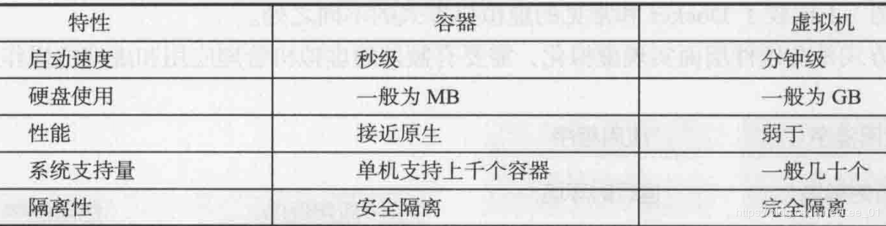
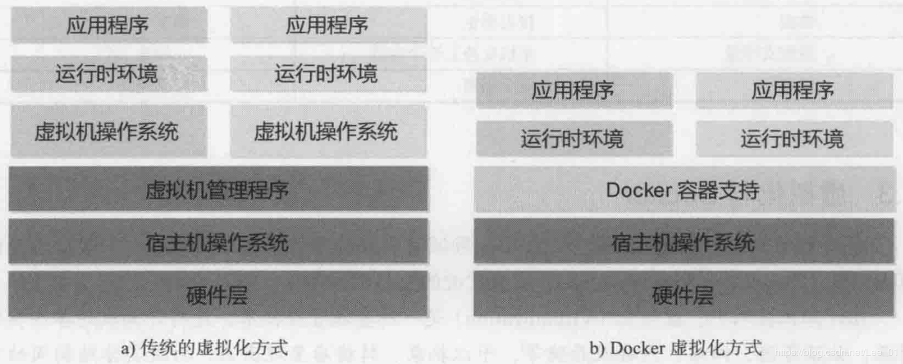
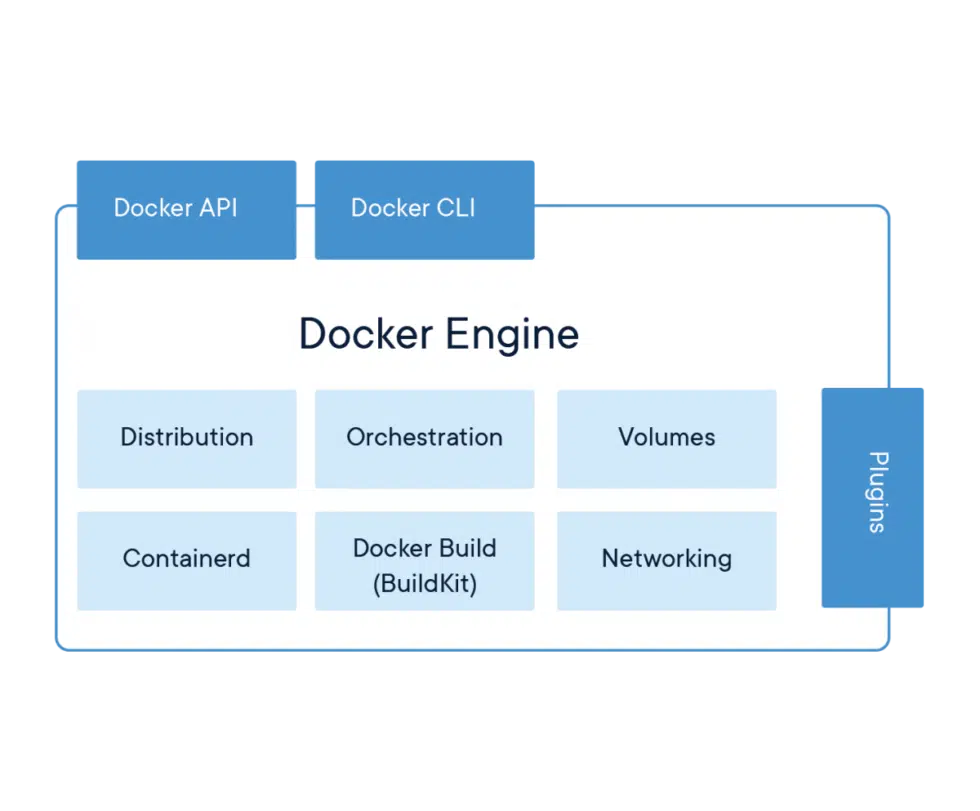

# Docker

"Debug your app, not your environment."
"Develop faster. Run anywhere."

## 什么是Docker？

* 应用容器引擎
* 官网：https://www.docker.com/
* 官方文档：https://docs.docker.com/
* 官方的公开镜像仓库：https://hub.docker.com/   http://dockerhub.com/   301 Moved Permanently

## 虚拟化技术

* 将计算机的各种硬件资源，例如CPU、内存、磁盘以及网络等，看做资源池，系统管理员可以对其进行重新分配，而不用考虑底层物理硬件
* 虚拟化技术解决的问题：1.高性能计算机硬件的产能过剩；2.把老旧的计算机硬件重新组合，作为一个整体的资源来用，化零为整。
* Linux平台的虚拟化产品：KVM，Xen，VMWare，VirtualBox
* Windows平台的虚拟化产品：Hyper V，VMWare，VirtualBox
* 虚拟化系统可以在宿主机上虚拟化出一套完整的硬件基础设施，配以操作系统，相当于虚拟出一台计算机
* 虚拟机对底层系统来说，就是一个文件。
* 虚拟机之间是相互隔离的。
* 虚拟化技术的缺点：资源占用多，一个虚拟机实例需要完整的操作系统及其附属应用，实际可能只需要部分功能和应用；冗余步骤多，启动慢

## 容器技术

* 容器，是一种轻量级的操作系统级的虚拟化，可以让用户在一个资源隔离的进程中运行应用及其依赖项。运行应用程序所必须的组件都讲打包成一个镜像并可以复用。

## docker与虚拟机的比较

## 为什么需要docker？

* 解决的问题：开发环境和生产环境的一致性（依赖，版本，配置，网络。。。）
* 跨平台容易，方便部署，扩展，迁移。
* 一次构建、随处运行（**Build once，Run everywhere**）
* 举例：一般通过LAMP搭建网站时，往往需要很多配置环境的操作，当迁移系统到其他云平台时，需要重新部署和调试，而有了容器技术来打包应用，迁移系统就变得在新的云平台上启动容器那么简单了

## docker在DevOps（开发/运维）中的优势？

* 敏捷：更快速的交付和部署
* 提高生产力：容器可以看做一个微服务，容器之间相互独立，可以独立升级，避免跨服务的依赖和冲突
* 节省资源：不需要额外的虚拟化管理程序支持
* 安全：容器之间的进程是相互隔离的（使用沙箱技术）

## docker架构

Docker Engine

## 相关概念

* 镜像(Image)：软件打包好的镜像
* 容器(Container)：镜像启动后的实例称为一个容器；容器是独立运行的一个或一组应用
* 仓库(Registry)：用来保存各种打包好的软件镜像
* 一个容器就是一个独立的虚拟操作系统，互不影响，而镜像就是这个操作系统的安装包
* 类似面向对象程序设计中的类和实例，镜像是静态的定义，容器是镜像运行时的实体
* 镜像本身是可读的，启动镜像时，Docker会在镜像的最上一层创建一个可写层

## 镜像的命名规则

* 镜像名包括命名空间和仓库名
* 标签用于区分不同版本的镜像

## 容器的状态

* 已创建（created）、重启中（restarting）、运行中（running）、已暂停（paused）和已退出（exited）
* 容器可以被创建、启动、运行、停止、删除、暂停

