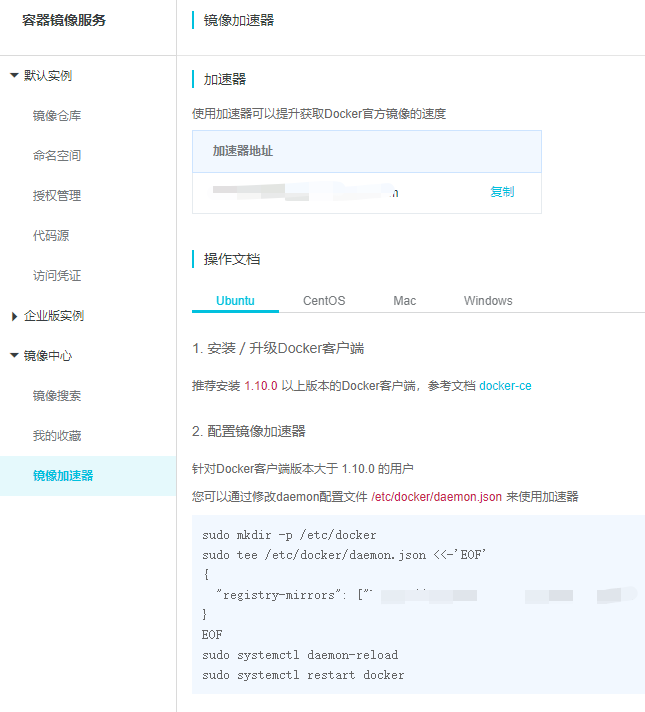

# 安装 Docker

## Windows or Mac

直接安装 Docker Desktop（同时也会安装 Docker Compose）

## Linux下安装Docker CE
 
* 参考[官方文档](https://docs.docker.com/engine/install/)
* 参见[阿里云的文档](https://yq.aliyun.com/articles/110806)

```bash
# step 1: 安装必要的一些系统工具
sudo apt update
sudo apt -y install apt-transport-https ca-certificates curl software-properties-common
# step 2: 安装GPG证书
curl -fsSL http://mirrors.aliyun.com/docker-ce/linux/ubuntu/gpg | sudo apt-key add -
# Step 3: 写入软件源信息
sudo add-apt-repository "deb [arch=amd64] http://mirrors.aliyun.com/docker-ce/linux/ubuntu $(lsb_release -cs) stable"
# Step 4: 更新并安装 Docker-CE
sudo apt -y update
sudo apt -y install docker-ce
```

* 配置阿里云加速镜像
  

### 启动docker

```bash
systemctl start docker
```

### 将Docker服务设为开机启动

```bash
systemctl enable docker
```

### 停止docker

```bash
systemctl stop docker
```

### 免root执行

* 问题

> 直接执行docker命令会遇到权限问题， 原因是/var/run/docker.sock文件，除root用户，只有docker组用户才可读写
>
> #ls -l /var/run/docker.sock
> srw-rw---- 1 root docker 0 juin  20 11:45 /var/run/docker.sock

* 解决方法

```bash
sudo groupadd docker     #添加docker用户组
sudo gpasswd -a $USER docker     #将登陆用户加入到docker用户组中
newgrp docker     #更新用户组
sudo service docker restart # 重启docker服务
```

### 查看docker服务状态

```bash
sudo systemctl status docker
```
