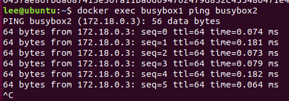

# Docker Network

```bash
docker network create -d bridge snet1
docker network ls

docker run -itd --name busybox1 --network snet1 busybox
docker run -itd --name busybox2 --network snet1 busybox

docker exec busybox1 ping busybox2
```

