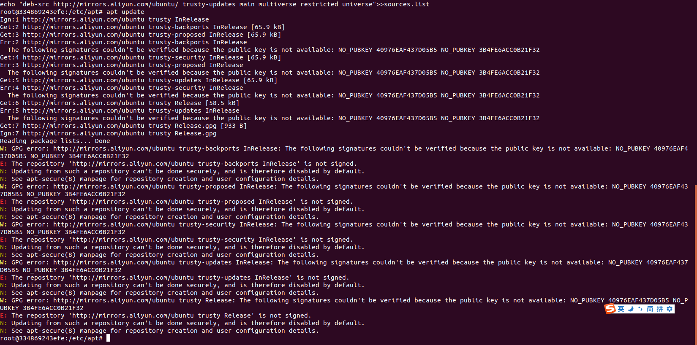
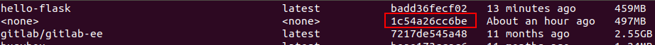
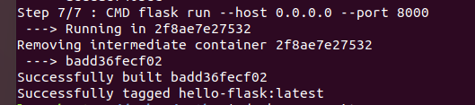
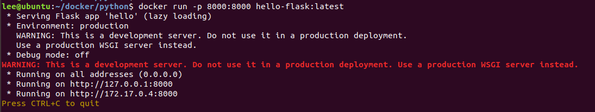

# Questions and Answers

## Ubuntu - bash: ping: command not found

```bash
sudo apt-get update
sudo apt-get install iputils-ping
```

## ubuntu 容器apt更换阿里云源失败记录

```bash
# 先进入容器内
docker exec -it 容器ID bash

# 进入配置文件所在目录
cd /etc/apt

# 备份
cp sources.list sources.list.bak

# 清空原配置的内容
echo "">sources.list

echo "deb http://mirrors.aliyun.com/ubuntu/ trusty main multiverse restricted universe">>sources.list
echo "deb http://mirrors.aliyun.com/ubuntu/ trusty-backports main multiverse restricted universe">>sources.list
echo "deb http://mirrors.aliyun.com/ubuntu/ trusty-proposed main multiverse restricted universe">>sources.list
echo "deb http://mirrors.aliyun.com/ubuntu/ trusty-security main multiverse restricted universe">>sources.list
echo "deb http://mirrors.aliyun.com/ubuntu/ trusty-updates main multiverse restricted universe">>sources.list
echo "deb-src http://mirrors.aliyun.com/ubuntu/ trusty main multiverse restricted universe">>sources.list
echo "deb-src http://mirrors.aliyun.com/ubuntu/ trusty-backports main multiverse restricted universe">>sources.list
echo "deb-src http://mirrors.aliyun.com/ubuntu/ trusty-proposed main multiverse restricted universe">>sources.list
echo "deb-src http://mirrors.aliyun.com/ubuntu/ trusty-security main multiverse restricted universe">>sources.list
echo "deb-src http://mirrors.aliyun.com/ubuntu/ trusty-updates main multiverse restricted universe">>sources.list

# 更新
apt update
```

`apt update` 报错：



注册一下key

```bash
apt-key adv --keyserver kerserver.ubuntu.com --recv-keys 3B4FE6ACC0B21F32
```

还是报错：

> E: gnupg, gnupg2 and gnupg1 do not seem to be installed, but one of them is required for this operation

放弃治疗，直接容器配置到Windows代理

```bash
set http_proxy=http://192.168.1.104:7890 & set https_proxy=http://192.168.1.104:7890
```

## python in docker+ubuntu+pip install报错

使用docker官方文档的[docker build](https://docs.docker.com/build/building/packaging/)例子，写了个python flask相关的Dockerfile

```dockerfile
FROM ubuntu:22.04

RUN apt-get update && apt-get install -y python3 python3-pip
RUN pip install flask==2.1.*

COPY hello.py /

ENV FLASK_APP=hello
EXPOSE 8000
CMD flask run --host 0.0.0.0 --port 8000
```

构建镜像

```bash
docker build -t hello-flask:latest .
```
结果报错，卡在 `pip install flask==2.1.*` 这一步。

先用docker images找到最后构建失败所用的镜像，这个镜像是根据dockerfile构建的中间层镜像。

跑起来看看

```bash
docker run -it --rm 1c54a26cc6be
```
在容器中运行报错的指令，重现问题
```text
root@75b426a89abc:/# pip install flask
Collecting flask
  Downloading Flask-2.2.2-py3-none-any.whl (101 kB)
     ━━━━━━━━━━━━━━━━━━━━━━━━━━━━━━━━━━━━━━━━ 0.0/101.5 KB ? eta -:--:--ERROR: Exception:
Traceback (most recent call last):
  File "/usr/lib/python3/dist-packages/pip/_internal/cli/base_command.py", line 165, in exc_logging_wrapper
    status = run_func(*args)
  File "/usr/lib/python3/dist-packages/pip/_internal/cli/req_command.py", line 205, in wrapper
    return func(self, options, args)
  File "/usr/lib/python3/dist-packages/pip/_internal/commands/install.py", line 339, in run
    requirement_set = resolver.resolve(
  File "/usr/lib/python3/dist-packages/pip/_internal/resolution/resolvelib/resolver.py", line 94, in resolve
    result = self._result = resolver.resolve(
  File "/usr/lib/python3/dist-packages/pip/_vendor/resolvelib/resolvers.py", line 481, in resolve
    state = resolution.resolve(requirements, max_rounds=max_rounds)
  File "/usr/lib/python3/dist-packages/pip/_vendor/resolvelib/resolvers.py", line 348, in resolve
    self._add_to_criteria(self.state.criteria, r, parent=None)
  File "/usr/lib/python3/dist-packages/pip/_vendor/resolvelib/resolvers.py", line 172, in _add_to_criteria
    if not criterion.candidates:
  File "/usr/lib/python3/dist-packages/pip/_vendor/resolvelib/structs.py", line 151, in __bool__
    return bool(self._sequence)
  File "/usr/lib/python3/dist-packages/pip/_internal/resolution/resolvelib/found_candidates.py", line 155, in __bool__
    return any(self)
  File "/usr/lib/python3/dist-packages/pip/_internal/resolution/resolvelib/found_candidates.py", line 143, in <genexpr>
    return (c for c in iterator if id(c) not in self._incompatible_ids)
  File "/usr/lib/python3/dist-packages/pip/_internal/resolution/resolvelib/found_candidates.py", line 47, in _iter_built
    candidate = func()
  File "/usr/lib/python3/dist-packages/pip/_internal/resolution/resolvelib/factory.py", line 215, in _make_candidate_from_link
    self._link_candidate_cache[link] = LinkCandidate(
  File "/usr/lib/python3/dist-packages/pip/_internal/resolution/resolvelib/candidates.py", line 288, in __init__
    super().__init__(
  File "/usr/lib/python3/dist-packages/pip/_internal/resolution/resolvelib/candidates.py", line 158, in __init__
    self.dist = self._prepare()
  File "/usr/lib/python3/dist-packages/pip/_internal/resolution/resolvelib/candidates.py", line 227, in _prepare
    dist = self._prepare_distribution()
  File "/usr/lib/python3/dist-packages/pip/_internal/resolution/resolvelib/candidates.py", line 299, in _prepare_distribution
    return preparer.prepare_linked_requirement(self._ireq, parallel_builds=True)
  File "/usr/lib/python3/dist-packages/pip/_internal/operations/prepare.py", line 487, in prepare_linked_requirement
    return self._prepare_linked_requirement(req, parallel_builds)
  File "/usr/lib/python3/dist-packages/pip/_internal/operations/prepare.py", line 532, in _prepare_linked_requirement
    local_file = unpack_url(
  File "/usr/lib/python3/dist-packages/pip/_internal/operations/prepare.py", line 214, in unpack_url
    file = get_http_url(
  File "/usr/lib/python3/dist-packages/pip/_internal/operations/prepare.py", line 94, in get_http_url
    from_path, content_type = download(link, temp_dir.path)
  File "/usr/lib/python3/dist-packages/pip/_internal/network/download.py", line 146, in __call__
    for chunk in chunks:
  File "/usr/lib/python3/dist-packages/pip/_internal/cli/progress_bars.py", line 303, in _rich_progress_bar
    with progress:
  File "/usr/lib/python3/dist-packages/pip/_vendor/rich/progress.py", line 652, in __enter__
    self.start()
  File "/usr/lib/python3/dist-packages/pip/_vendor/rich/progress.py", line 643, in start
    self.live.start(refresh=True)
  File "/usr/lib/python3/dist-packages/pip/_vendor/rich/live.py", line 124, in start
    self._refresh_thread.start()
  File "/usr/lib/python3.10/threading.py", line 935, in start
    _start_new_thread(self._bootstrap, ())
RuntimeError: can't start new thread
```

### Why
ubuntu和docker版本不兼容，参考[stackoverflow](https://stackoverflow.com/questions/70087344/python-in-docker-runtimeerror-cant-start-new-thread)

### Solution
ubuntu镜像将版本
```
FROM ubuntu:20.04
```





### 排查过的点
* pip版本
* 网络问题（pip改用国内源也没用）
