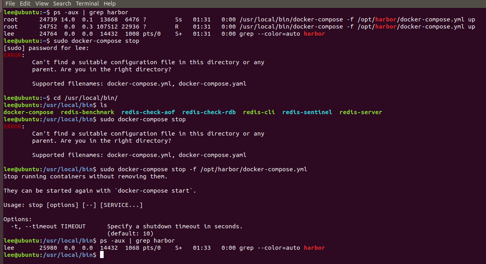

# Linux Docker安装harbor

0. 前置条件：安装docker和docker-compose

1. 先下载安装包：https://github.com/goharbor/harbor/releases

2. 解压到指定目录
```bash
sudo tar -zxf harbor-offline-installer-v2.1.0.tgz -C /opt/
```
3. 安装
```bash
cd /opt/harbor/
./install.sh
```
4. 停止harbor
```bash
sudo docker-compose stop -f /opt/harbor/docker-compose.yml
```

> 停止服务： docker-compose stop
开始服务： docker-compose start
重启服务：docker-compose restart
停止服务并删除容器：docker-compose down
启动服务并运行容器：docker-compose up

## Reference

* https://www.jianshu.com/p/467e8cdd9eec
