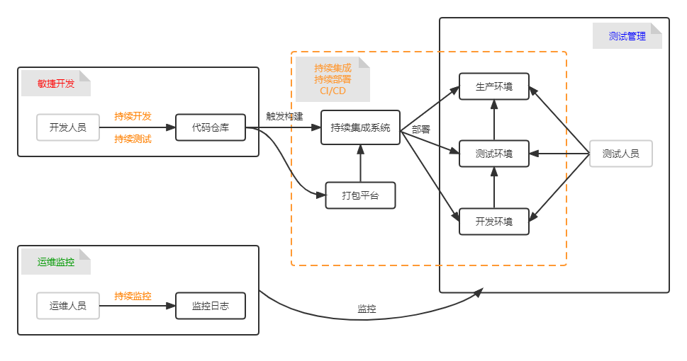

# DevOps

## Cloud Native

### Docker

### Kubernetes k8s

### K3S

### Rancher

## Registry Manager

### [Nexus](https://www.sonatype.com/products/nexus-repository)

### [Harbor](https://goharbor.io/)

## Continuous Integration

### [GitLab CI](https://docs.gitlab.com/ee/ci/)

### [GitHub Actions](https://docs.github.com/en/actions)

### [Jenkins](https://www.jenkins.io/)

### [Travis CI](https://www.travis-ci.com/)

### [circleci](https://circleci.com/)

## Reference

* https://blog.csdn.net/g6U8W7p06dCO99fQ3/article/details/82056948
* https://blog.csdn.net/dancuowang/article/details/109328014
